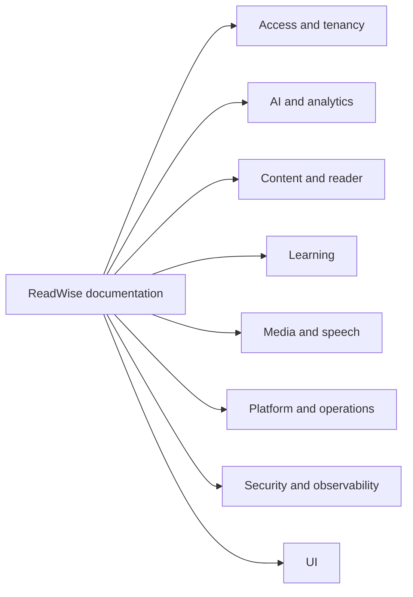

# ReadWise documentation index

This directory contains the durable reference documentation for the current
ReadWise codebase. Documentation is organized by subsystem. Each subsystem
directory stays flat: add documents directly under the subsystem directory rather
than creating nested folders.

Keep feature docs aligned with code under `src/`, the Prisma schemas under
`prisma/`, and scripts in `package.json` / `scripts/`.

## Documentation map

## Start here

| Document | Scope |
| --- | --- |
| [`../README.md`](../README.md) | Project overview, local setup, scripts, deployment, and high-level architecture. |
| [`platform/database.md`](./platform/database.md) | SQLite and PostgreSQL workflows, local parity stack, migration testing, and data migration notes. |
| [`platform/database-runbooks.md`](./platform/database-runbooks.md) | Backup, restore, rollback, and disaster-recovery runbooks. |
| [`platform/ci.md`](./platform/ci.md) | CI quality gates, required checks, E2E tiers, and failure diagnosis. |
| [`platform/git-workflow.md`](./platform/git-workflow.md) | Three-branch model (main/dev/insiders), branch naming, worktree workflow, and promotion pipeline. |

### Access and tenancy

| Document | Scope |
| --- | --- |
| [`access/account-lifecycle.md`](./access/account-lifecycle.md) | Account export, self-service deletion, admin member deletion/role changes, support actions, cascades, and last-admin guards. |
| [`access/multi-tenancy.md`](./access/multi-tenancy.md) | Organizations, memberships, classrooms, assignments, tenant-aware cache keys, and tenant analytics privacy. |
| [`access/rbac.md`](./access/rbac.md) | Capability-based authorization for global roles and tenant/classroom memberships. |

### AI

| Document | Scope |
| --- | --- |
| [`ai/context-management.md`](./ai/context-management.md) | AI provider abstraction, long-context chunking, cache versioning, and graceful fallbacks. |
| [`ai/prompts.md`](./ai/prompts.md) | Prompt registry, prompt versions, and backfill/rebuild guidance. |
| [`ai/safety.md`](./ai/safety.md) | Structured output validation, moderation, provider error normalization, and safe fallbacks. |
| [`ai/evaluations.md`](./ai/evaluations.md) | Offline/live AI evaluation harness and datasets. |
| [`ai/governance-ledger.md`](./ai/governance-ledger.md) | AI invocation ledger, budgets/quotas, usage summaries, cost estimates, and privacy boundaries. |

### Analytics

| Document | Scope |
| --- | --- |
| [`analytics/product-analytics.md`](./analytics/product-analytics.md) | Product analytics event stream, retention, dashboards, and privacy rules. |
| [`analytics/domain-reporting.md`](./analytics/domain-reporting.md) | Domain reporting read models: on-demand aggregations, per-domain ownership, query boundaries, and privacy rules distinguishing domain state from the product event stream. |
| [`analytics/tenant-reporting-privacy.md`](./analytics/tenant-reporting-privacy.md) | Teacher and admin visibility bounds, per-learner vs aggregate rules, domain ownership of reporting facts, and tenant-scoped retention and export policy. |

### Architecture

| Document | Scope |
| --- | --- |
| [`architecture/`](./architecture/) | Architecture decision records. Start with [`architecture/README.md`](./architecture/README.md). |
| [`architecture/0010-subsystem-boundaries-and-import-contracts.md`](./architecture/0010-subsystem-boundaries-and-import-contracts.md) | First-class subsystem ownership model, public API and private import rules, allowlist strategy, and phased enforcement backlog. New work must respect the subsystem boundary contract defined here. |

### Content ingestion and policy

| Document | Scope |
| --- | --- |
| [`content/article-library.md`](./content/article-library.md) | Article access policy, lifecycle axes, public/private listings, admin article operations, moderation, and content safety boundaries. |
| [`content/content-policy.md`](./content/content-policy.md) | Source governance, provider health, rights metadata, review, and takedown workflow. |
| [`content/legal-content.md`](./content/legal-content.md) | Legal/static content responsibilities. |
| [`content/scrapers.md`](./content/scrapers.md) | Scraper providers, discovery/extraction, SSRF/robots controls, provider drift handling, and scrape-review feedback retention. |
| [`content/extraction-quality.md`](./content/extraction-quality.md) | Content extraction quality signals, composite score, and scraper drift triage workflow. |
| [`content/article-quality-cleanup-design.md`](./content/article-quality-cleanup-design.md) | Proposed backlog cleanup and duplicate-analysis design for scraped public-library articles. |
| [`content/incremental-provider-scraping-design.md`](./content/incremental-provider-scraping-design.md) | Stateful incremental provider ingestion: governing invariant, durable discovery ledger data model (DiscoverySource, CrawlCandidate, UrlAlias, DiscoveryObservation, CanonicalConflict), enums, uniqueness, cascade/retention decisions, versioned URL normalization / public article identity (Phase 1.2), the idempotent baseline seed / conflict isolation from existing public Articles (Phase 1.3), the SSRF-safe discovery fetch seam exposing response metadata / conditional requests / typed outcomes (Phase 1.4), and the atomic paged discovery commit + candidate classification (Phase 1.5), and the watermark / overlap / validator-calibration / gap-detection frontier (Phase 1.6), and leased discovery-source scheduling in the worker — claim/lease model, pure scheduler clock, role tiers, bounded resumable runs, and failure isolation (Phase 1.7), and the baseline & strict shadow lifecycle — state machine, OBSERVED_BASELINE/OBSERVED_SHADOW mapping, gated baseline completion, immediate second-scan cutover, and bounded activation catch-up (Phase 1.8), and source observability, auto-degradation, and the capability-gated admin API + admin UI (`/admin/discovery-sources` list & detail with lifecycle action controls) — Phase 1.9, and the atomic candidate-based `ARTICLE_INGEST` enqueue inside the discovery page-commit transaction — payload/dedupe-key design, eligible-only/ACTIVE-only gating, and the #1095 worker hand-off boundary (Phase 2.1), and the resolution of final canonical identity + versioned body fingerprints under concurrency — trusted final-URL/canonical resolution with associated-domain rules and cross-provider ownership transfer, exact-only prose fingerprinting, guarded collision-merge with alias/observation retention + loser-job cancellation, convergence-after-conflict, and auditable NEEDS_REVIEW routing (Phase 2.2), and propagation retries, quarantine & extractor-version reactivation — pure failure classification, propagation grace + backoff + Retry-After, and guarded quarantine/reactivation persistence (Phase 2.3), and the rate governor — a shared per-hostname budget across discovery + body, provider fairness / anti-starvation, incremental-over-backfill priority reservation, independent discovery/body/AI cost budgets, Retry-After / 429-403-5xx auto-pause, and backlog throttling over two durable per-UTC-day windows (Phase 2.4), and moving the normal admin + CLI provider triggers to an explicit `incremental` trigger mode over the ledger (with `backfill`/`force-rescrape` defined but deferred), the active→shadow rollback that parks scheduling, bumps `activationGeneration` to fail in-flight work closed, and cancels unclaimed candidate ingest jobs while retaining candidates/observations (Phase 2.7), and the measured public-provider rollout — the pure metadata-only rollout-gate evaluator (freshness, correctness hard-zeros, queue/retry/quarantine health, provider HTTP health, cost/budget) with a go/hold verdict, the data-only batch/tier config grouped by discovery strategy/risk with ramping per-day limits and baseline-required / auth-excluded guards, the fail-closed activation acceptance matrix, and the end-to-end rollback drill proving no stale task writes an Article after a generation change (Phase 2.8), and credentialRef-based authenticated provider ingestion — the secret-free `credentialRef` / `authIdentityKind` columns, the in-memory worker-side secret-resolver seam, the pure activation-eligibility policy rejecting signed-URL-only identities, pause-only-the-affected-source on missing/expired/rotated credentials with sanitized categories, and the fetch-permission≠publication-rights separation (Phase 2.9, closes epic #1079), and the operator candidate-review & explicit source-trust promotion — the `SKIPPED_REVIEW` rejection state, pure review/trust-eligibility policies, guarded idempotent approve/reject/reactivate persistence, capability-gated review-queue + trust endpoints with sanitized provenance DTOs and audit, and drift auto-demotion that returns a promoted source to shadow without deleting candidate history (Phase 3.1), and bounded low-priority historical backfill — the dedicated high-permission `POST /api/admin/backfill` endpoint, the `BackfillRun` checkpoint model surviving worker restarts, the pure bounds-clamp / reactivation-eligibility / lifecycle policies, the metadata-only dry-run, the guarded resumable `advanceBackfillRun` that flips `observedInBaseline` and enqueues LOW-priority (`-100`) candidate-ingest jobs reserving hostname capacity for real-time work, and idempotent pause/resume/cancel — reactivating only historical `OBSERVED_BASELINE`/`OBSERVED_SHADOW` identities without recreating a known Article (Phase 3.2; `SKIPPED_OUTSIDE_WINDOW` classification deferred to follow-up #1127), and the audited operator-only force-rescrape of a known public Article — the dedicated high-permission `POST /api/admin/articles/{id}/force-rescrape` endpoint, the `ArticleContentVersion` ledger with DB-enforced at-most-one pending/active slots, validate-before-activate with a deterministic failure taxonomy, and atomic in-place activation preserving Article identity + reading relationships (Phase 3.3), and re-anchoring reader annotations onto a validated replacement version — reusing the Reader `revalidateAnchor` engine with net-new ambiguity detection, an evolved reliability gate that BLOCKS and exposes unreliable (missing/ambiguous) anchors instead of dropping them, offset migration inside the activation transaction, and deduplicated version-scoped regeneration of ONLY content-derived outputs (never article-level relationships) (Phase 3.4), and resolving canonical-identity conflicts & governing deleted / withdrawn / taken-down Articles — the capability-gated conflict queue + `resolve` endpoint (one surviving public identity, losers archived with reader data retained), the Article-delete candidate stamp (permanent `governance:article-deleted` terminal + `articleDeletedAt`, no new enum) with explicit audited recovery as re-admission, and content-governance reuse (`applyTakedown`) preserving candidate/review history (Phase 3.5, closes epic #1080). |
| [`content/content-reporting.md`](./content/content-reporting.md) | User content-reporting workflow, admin moderation queue, report status lifecycle, and moderation signal rules. |

### Learning

| Document | Scope |
| --- | --- |
| [`learning/engagement-analytics.md`](./learning/engagement-analytics.md) | Reading progress, daily activity, streaks, shields, heatmaps, and reading-speed signals. |
| [`learning/gamification.md`](./learning/gamification.md) | Gamification summary route, streak/shield widgets, daily-goal progress, and due-review counts. |
| [`learning/difficulty-calibration.md`](./learning/difficulty-calibration.md) | Privacy-safe CEFR/Lexile-like calibration, NC dataset opt-in gate, provider DB drift snapshots, vocabulary penalty audit, and human label workflow. |
| [`learning/learning-and-mastery.md`](./learning/learning-and-mastery.md) | Word/article/skill mastery, Today comprehension feedback, coach memory, learner analytics, adaptive leveling, streaks, SRS, and study-plan signals. |
| [`learning/placement.md`](./learning/placement.md) | Reading placement passage flow, deterministic scoring, `PlacementResult` persistence, retake/skip behavior, and privacy rules. |
| [`learning/profile-preferences.md`](./learning/profile-preferences.md) | Onboarding/profile validation, CEFR/topics/daily-goal preferences, level history, and personalization consumers. |
| [`learning/today-session.md`](./learning/today-session.md) | Today Session: one durable learner-local-day workflow anchor, idempotent daily generation, user-selected primary articles, lightweight comprehension checks, target saved-word review, and timezone/local-date semantics. |
| [`learning/study-plan.md`](./learning/study-plan.md) | Dynamic Study Plan diagnostics, `/study` mode, due flashcards, cloze fallback, and saved-word review routes. |
| [`learning/review-assets.md`](./learning/review-assets.md) | Review assets: optional, low-pressure conversion of existing highlights/notes into flashcard/SRS review cards, content-free Progress/Study counts, and the additive Today reflection bonus. |
| [`learning/reading-series.md`](./learning/reading-series.md) | Curated reading series, learner `/series` browser, enroll/unenroll APIs, Today soft-candidate integration, and remaining admin/export gaps. |
| [`learning/teacher-workflows.md`](./learning/teacher-workflows.md) | Teacher classroom and assignment workflows, student completion state, classroom analytics boundaries, and Access/Learning ownership split. |

### Media

| Document | Scope |
| --- | --- |
| [`media/assets.md`](./media/assets.md) | `MediaAsset` ownership, creation, keying, serving, migration, and deletion lifecycle. |
| [`media/storage.md`](./media/storage.md) | Local/Azure media storage and speech-audio persistence. |

### Observability

| Document | Scope |
| --- | --- |
| [`observability/overview.md`](./observability/overview.md) | Tracing, error aggregation, metrics, SLOs, and investigation workflow. |
| [`observability/metrics.md`](./observability/metrics.md) | In-process counter/histogram/cache-stat registry, Prometheus text-format exporter, per-domain recorder helpers, and route-path normalisation. |
| [`observability/client-error-reporting.md`](./observability/client-error-reporting.md) | Browser runtime error sink, scrubbing, rate limiting, aggregation, and alerting behavior. |

### Operations

| Document | Scope |
| --- | --- |
| [`operations/admin-operations.md`](./operations/admin-operations.md) | Persistent job queue, processing-step state, audit logs, provider operations, admin endpoints, and operator workflows. |
| [`operations/release-management.md`](./operations/release-management.md) | End-to-end release process: preflight quality gates, migration steps for both database targets, deployment, smoke verification, rollback decision tree, and post-release monitoring. |
| [`operations/incident-response.md`](./operations/incident-response.md) | On-call SLO breach runbooks: detection, triage, mitigation, and post-incident review workflow. |
| [`operations/capacity-planning.md`](./operations/capacity-planning.md) | Known subsystem limits, observable signals, baseline assumptions, scaling levers, Redis adoption gate, and follow-up gaps for each major ReadWise subsystem. |
| [`operations/provider-operations.md`](./operations/provider-operations.md) | Common lifecycle model for all external providers: health states, credential rotation, outage response, and provider-drift handling. |
| [`operations/security-audit.md`](./operations/security-audit.md) | Security event and audit-log operations: `/admin/security`, recent event triage, durable audit-log reads, retention, and privacy-safe investigation rules. |
| [`operations/tts-jobs.md`](./operations/tts-jobs.md) | `TTS_GENERATE` job scheduling, deduplication, retry policy, and rebuild flow under Operations ownership. |
| [`operations/performance-tuning.md`](./operations/performance-tuning.md) | Database/query performance metrics, PostgreSQL slow-query logging, pg_stat_statements, pooling, and listing/feed benchmarks. |

### Platform

| Document | Scope |
| --- | --- |
| [`platform/api-catalog.md`](./platform/api-catalog.md) | Generated API catalog. |
| [`platform/api-catalog.json`](./platform/api-catalog.json) | Machine-readable generated API catalog. |
| [`platform/authentication.md`](./platform/authentication.md) | NextAuth provider registry, database sessions, local sign-in/test-session onboarding, first-user admin bootstrap, cookie posture, and auth guard layering. |
| [`platform/ci.md`](./platform/ci.md) | CI quality gates, required checks, E2E tiers, and failure diagnosis. |
| [`platform/database.md`](./platform/database.md) | SQLite and PostgreSQL workflows, local parity stack, migration testing, and data migration notes. |
| [`platform/database-runbooks.md`](./platform/database-runbooks.md) | Backup, restore, rollback, and disaster-recovery runbooks. |
| [`platform/dependency-injection.md`](./platform/dependency-injection.md) | Dependency injection seams and testing guidance. |
| [`platform/documentation-governance.md`](./platform/documentation-governance.md) | Documentation metadata schema, rename/merge/delete/create decisions, generated-doc handling, and freshness checklist. |
| [`platform/health-readiness.md`](./platform/health-readiness.md) | `/api/health`, `/api/ready`, runtime config validation, migrations, and optional-provider degradation. |
| [`platform/runtime-config.md`](./platform/runtime-config.md) | Runtime configuration ownership, typed helpers, and the documented `process.env` allowlist. |
| [`platform/push-notifications.md`](./platform/push-notifications.md) | Web Push configuration, subscription lifecycle, reminder scheduling, delivery health, and privacy. |
| [`platform/primitives.md`](./platform/primitives.md) | Summary pointer to `src/lib/primitives/README.md`; classification table, contribution guidelines, and stability contract for shared platform primitives. |
| [`platform/internationalization.md`](./platform/internationalization.md) | UI internationalization foundation: i18n architecture, locale loading, and separation from article-translation and learner language-preference systems. |
| [`platform/schema-change-checklist.md`](./platform/schema-change-checklist.md) | Privacy, retention, export, and cascade checklist required for every Prisma model or migration change. |
| [`platform/test-data-governance.md`](./platform/test-data-governance.md) | Test data and fixture governance across unit factories, Prisma/DB seeds, Playwright e2e seeds, scraper corpora, and AI evaluation datasets. |
| [`platform/supply-chain.md`](./platform/supply-chain.md) | Dependency hygiene policy, CI vulnerability gates, response procedures for security advisories, and bundled third-party generated data attribution. |
| [`platform/static-assets.md`](./platform/static-assets.md) | Static asset and public file guidance. |

### Reader

| Document | Scope |
| --- | --- |
| [`reader/bookmarks-and-lists.md`](./reader/bookmarks-and-lists.md) | Default Saved list, custom reading lists, list membership, IDOR protections, and export/deletion behavior. |
| [`reader/imports.md`](./reader/imports.md) | URL/text personal imports, SSRF and sanitization controls, de-duplication, daily quota, audit, and analytics metadata. |
| [`reader/lexical-dictionary.md`](./reader/lexical-dictionary.md) | Dictionary lookup provider seam, word normalization, saved-word persistence, mastery exposure, and privacy rules. |
| [`reader/offline-sync.md`](./reader/offline-sync.md) | Offline mutation queue, conflict resolution, cache versioning, background-sync resilience, and push reminders. |
| [`reader/annotations.md`](./reader/annotations.md) | Highlights, notes, anchor revalidation, offline note merge, and reader annotation APIs. |
| [`reader/reader-tools.md`](./reader/reader-tools.md) | Reader learning tools: vocabulary, quiz, tutor, dictation, pronunciation, grammar, selection tools, fallbacks, offline behavior, and privacy boundaries. |
| [`reader/recommendations.md`](./reader/recommendations.md) | Scored Picks candidate boundary, per-user context, scoring weights, diversity pass, explanations, and privacy. |
| [`reader/search-and-indexing.md`](./reader/search-and-indexing.md) | Search and indexing strategy. |
| [`reader/playback.md`](./reader/playback.md) | `ReaderAudioProvider` context, `ReaderMiniPlayer` transport controls, word highlighting, speed/sentence-loop controls, and access-checked playback initiation. |
| [`reader/translation.md`](./reader/translation.md) | Full-article and sentence translation cache keys, chunking, prompt versions, fallbacks, and privacy boundaries. |

### Security

| Document | Scope |
| --- | --- |
| [`security/overview.md`](./security/overview.md) | Trusted proxy/IP handling, CSRF, destructive-action protections, security events, and audit-log relationship. |
| [`security/data-lifecycle-matrix.md`](./security/data-lifecycle-matrix.md) | Data classification and retention matrix for all Prisma models and client-side ephemeral stores; gaps flagged as follow-up items. |
| [`security/abuse-prevention.md`](./security/abuse-prevention.md) | Abuse-prevention signals, rate-limit thresholds, and mitigation hooks; distinguishes implemented controls from proposed design targets. |

### Speech

| Document | Scope |
| --- | --- |
| [`speech/generation.md`](./speech/generation.md) | TTS provider seam, request building, voice and format fallback, word-boundary collection, and `ArticleSpeech` generation semantics. |
| [`speech/pronunciation-practice.md`](./speech/pronunciation-practice.md) | Browser-side Azure Speech pronunciation assessment, short-lived Speech tokens, attempt persistence, history, skill evidence, and privacy boundaries. |

### UI

| Document | Scope |
| --- | --- |
| [`ui/accessibility.md`](./ui/accessibility.md) | Accessibility baseline, automated axe/Playwright checks, configuration, and outstanding manual-verification gaps. |
| [`ui/design-system-governance.md`](./ui/design-system-governance.md) | Design-system governance and visual regression plan: component ownership, token conventions, primitive import rules, density rules, ESLint drift checks, and CI screenshot gating. |
| [`ui/mobile-reader-pwa.md`](./ui/mobile-reader-pwa.md) | Mobile/touch baseline for shell safe areas, Reader floating surfaces, the offline library, and PWA install/caching behavior. |

## Maintenance rules

- Prefer updating these durable docs over adding ad-hoc notes.
- Historical spikes belong under `docs/spikes/` only while they are actively
  useful. Delete or promote them once code/architecture/reference docs supersede
  them.
- Keep environment-variable tables consistent with `.env.example` and
  `src/lib/runtime-config/`.
- Keep script examples consistent with `package.json` and `scripts/*.ts` help
  output.
- Keep schema/model descriptions consistent with both `prisma/schema.prisma` and
  `prisma/postgresql/schema.prisma` when PostgreSQL parity is affected.

