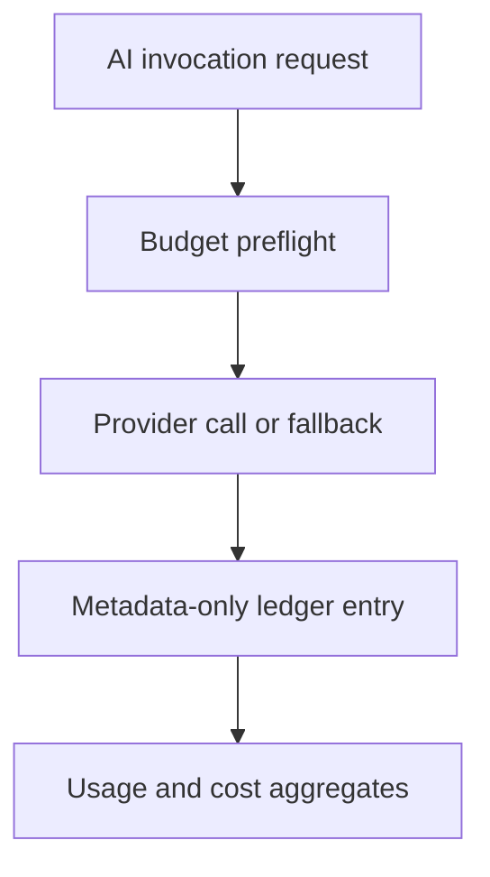

# AI governance ledger, budgets, and usage reporting

ReadWise treats every AI provider call as a governed product operation: calls are
budgeted before execution, recorded after execution, and reported through admin
analytics without storing prompts, responses, selected text, or article bodies.

This document expands the ADR in
[`../architecture/0006-ai-governance-ledger-and-budgets.md`](../architecture/0006-ai-governance-ledger-and-budgets.md)
and should be read with [`context-management.md`](./context-management.md),
[`prompts.md`](./prompts.md), and [`safety.md`](./safety.md).

## Governed invocation flow

## Code map

| Area | Code | Purpose |
| --- | --- | --- |
| Provider orchestration | `src/lib/ai/facade.ts` | Single chat-completion entry point; applies quotas, retries, metrics, tracing, and ledger writes. |
| Ledger writer | `src/lib/ai/ledger.ts` | Metadata-only `AiInvocation` persistence, best-effort and test-gated. |
| Quotas/budgets | `src/lib/ai/budget.ts` | Fixed-window per-user, per-feature, and global budget counters. |
| Usage read model | `src/lib/ai/usage-summary.ts` | Aggregates ledger rows for admin analytics and budget status. |
| Config | `src/lib/runtime-config/ai.ts` | Provider, retry/timeout, cost-rate, ledger, and quota environment parsing. |
| Admin surface | `src/app/admin/analytics/ai/page.tsx`, `src/app/api/admin/ai/usage/route.ts` | Cost, volume, latency, fallback, and feature usage views. |

## Ledger contract

`AiInvocation` rows are operational metadata only:

- `feature`, `model`, `promptVersion`, `status`, `fallback`, `fallbackReason`, `cacheHit`
- optional `userId`, `articleId`, and `requestId`
- latency, token counts, and estimated USD cost

The ledger never accepts full prompts, model responses, article text, selected
text, definitions, credentials, or cookies. `recordAiInvocation` never throws;
if the write fails, the AI feature still follows its normal fallback path.
`fallbackReason` is a safe, low-cardinality enum such as
`provider_unconfigured`, `quota_exceeded`, `validation_failed`,
`content_filter`, `timeout`, `rate_limited`, or `server_error`; it never stores
prompt, article, selected-text, definition, translation, or model-output text.

In `NODE_ENV=test`, ledger persistence is disabled unless tests explicitly opt
in with `AI_LEDGER_ENABLED=1` and provide a mocked Prisma surface.

## Budget enforcement

Budget checks happen before the provider call in `chatCompleteWithMeta`.

| Kind | Used by | Enforced scopes | Failure behavior |
| --- | --- | --- | --- |
| `interactive` | User-facing API routes and lazy reader features | per-user, per-feature, global interactive | Throws `ApiError(429)` for a clean user-facing limit response. |
| `background` | Processor, worker, seed/backfill enrichment | per-feature, global background | Returns `null`; the caller skips work or returns a graceful fallback. |

Budget counters are fixed-window counters. The shared DB-backed rate-limit store
is used when available so limits hold across app instances; an in-memory fallback
keeps local/test environments graceful if that store is unavailable.

Per-feature counters are shared across interactive and background calls. This is
intentional: a runaway background job should not starve a feature indefinitely,
and operators can cap total feature volume regardless of source.

## Reporting and cost estimates

`summarizeAiUsage(filter)` reads the ledger to aggregate:

- total call count,
- token sums,
- estimated cost,
- fallback count,
- cache-hit count for rows explicitly recorded as cache hits,
- grouping by feature, model, and status.

Cost is estimated from token counts and model rate configuration. Unknown token
usage yields `null`/zero cost rather than guessing. Budget status compares
current-window ledger usage with configured limits; enforcement counters remain
the source of truth for blocking decisions.

## Cache and fallback interaction

Feature helpers use the shared cache-first lifecycle in `src/lib/ai/cache.ts`:

1. Return cached derived content when present.
2. Load an access-checked article or selected text context.
3. Return a fallback when AI is unconfigured, over budget, empty, invalid, or
   rejected by moderation.
4. Persist only validated successful output.

Fallbacks are never cached. This prevents placeholder output from blocking a
future successful generation after configuration or provider health recovers.
The shared article/selection cache lifecycle records two metadata-only ledger
rows that are not provider calls: cache hits (`cacheHit=true`) and lifecycle
fallbacks caused before/after provider calls (for example unconfigured provider
or validation rejection). Provider error/timeout/rate-limit reasons are recorded
by the chat-completion facade itself.

Admin cache-hit counts therefore mean "served from a shared AI-derived cache and
recorded by a participating cache-first helper"; they do not include unrelated
HTTP/browser/storage cache hits.

## Privacy and retention

- Treat ledger rows like audit/analytics metadata: safe ids and counts only.
- Never put prompt text, response text, article content, selected text, or user
  private content into `feature` or custom metadata. Provider and exception
  prose is not persisted; use the controlled `fallbackReason` taxonomy.
- `userId` and `articleId` are plain strings, not foreign keys, so ledger history
  can survive entity deletion for operations reporting. Apply explicit retention
  or erasure policy when required.
- Schedule `npm run maintenance:retention` for safe count output across AI,
  analytics, audit, and job retention helpers; add `--execute` only after counts
  are reviewed.
- For user-specific privacy requests, run
  `npm run privacy:erase-ledgers -- --user-id <id>` to count AI + analytics rows,
  then rerun with `--execute --operator-id <operator-id>` to delete them and
  write an `admin.ledger_erasure` audit row. The workflow stores only ids and
  counts, never prompt/response text or article content.

## Operational checklist

- Keep prompt version labels aligned with [`prompts.md`](./prompts.md).
- Configure quotas only where enforcement is desired; unset quota env vars mean
  unlimited for that scope.
- Treat optional provider unconfiguration as normal local/test behavior.
- Investigate high fallback rates by feature and fallback reason first, then
  correlate request ids with logs/traces from
  [`../observability/overview.md`](../observability/overview.md).

## Tests

Relevant tests include `tests/ai-ledger.test.ts`, `tests/ai-budget.test.ts`,
`tests/ai-cache-selection.test.ts`, `tests/ai-provider.test.ts`,
`tests/ai-runner.test.ts`, and admin AI analytics route tests.
