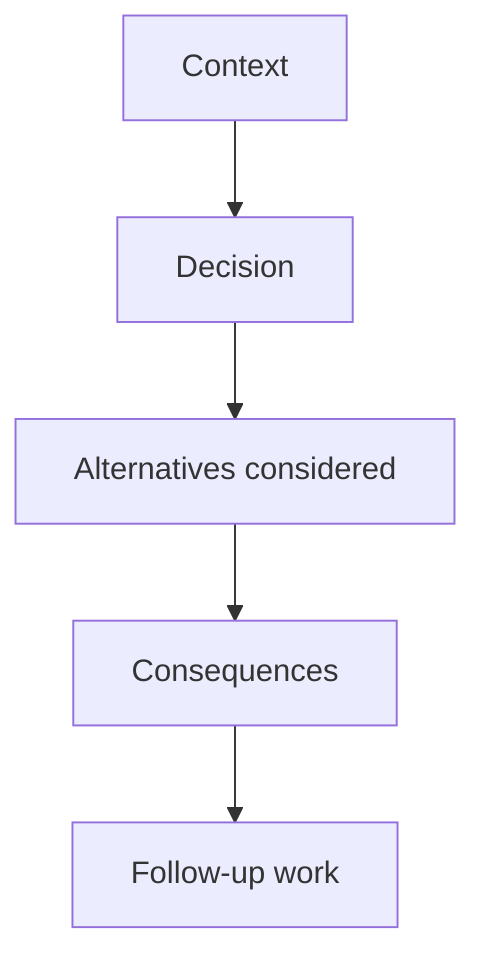

# ADR-NNNN: Title

- **Status:** Proposed | Accepted | Superseded by ADR-NNNN
- **Date:** YYYY-MM-DD
- **Related:** #issue, #epic

## ADR structure

## Context

What pressure, constraint, or product requirement made this decision necessary?

## Decision

What will ReadWise do?

## Alternatives considered

- **Option:** Why it was not chosen.
- **Option:** Why it was not chosen.

## Consequences

- Positive outcome.
- Trade-off or operational cost.
- Risk that must be watched.

## Follow-up work

- [ ] Issue or task needed to complete or revisit the decision.

