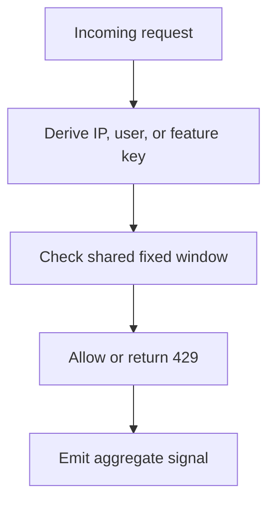

# ADR-0004: Shared server-side rate limiting

- **Status:** Accepted
- **Date:** 2026-06-22
- **Related:** #284 (RW-026), #277 (RW-019), #280 (RW-022), #324 (RW-066)

## Rate-limit decision

## Context

ReadWise has endpoints that can trigger AI, scraping, speech synthesis, dictionary lookups, and client error reporting. Per-route ad hoc throttles would be inconsistent and easy to bypass.

## Decision

Introduce a shared server-side fixed-window counter in
`src/lib/security/fixed-window-counter.ts`, with rate-limit scope/key/limit
policy in `src/lib/security/rate-limit/index.ts`. API routes and
worker-triggering paths use the policy layer; AI budgets and security-event
spike detection consume the counter directly for their own domain decisions.

The counter hides the atomic `RateLimitCounter` upsert, process-memory fallback,
expiry and probabilistic sweeping, and a 30-second database-failure cooldown.
Database windows are epoch-aligned. Consumers explicitly select the existing
process-memory behavior they require: rate limits preserve their first-hit
fallback windows, AI budgets use epoch-aligned fallback windows, and synchronous
security-event observation uses a local first-hit window while mirroring an
epoch-aligned count to the database best-effort.

## Alternatives considered

- **Client-side throttling only:** Improves UX but does not protect services.
- **One-off limits per route:** Quick, but inconsistent and hard to tune.
- **Provider-only quotas:** Helpful backstop, but too late to protect ReadWise UX or costs.

## Consequences

- Expensive and abuse-prone features can share predictable enforcement.
- Counter storage and fallback behavior have one implementation while each
    consumer retains its own policy and failure semantics.
- Tests should cover key generation and 429 behavior for sensitive routes.
- The database adapter coordinates counts across app instances; memory remains a
    process-local availability fallback and cannot provide cross-instance limits.

## Follow-up work

- [x] #284: implement shared rate limiting.
- [x] Align AI budgets in #280 with rate-limit keys where possible.

