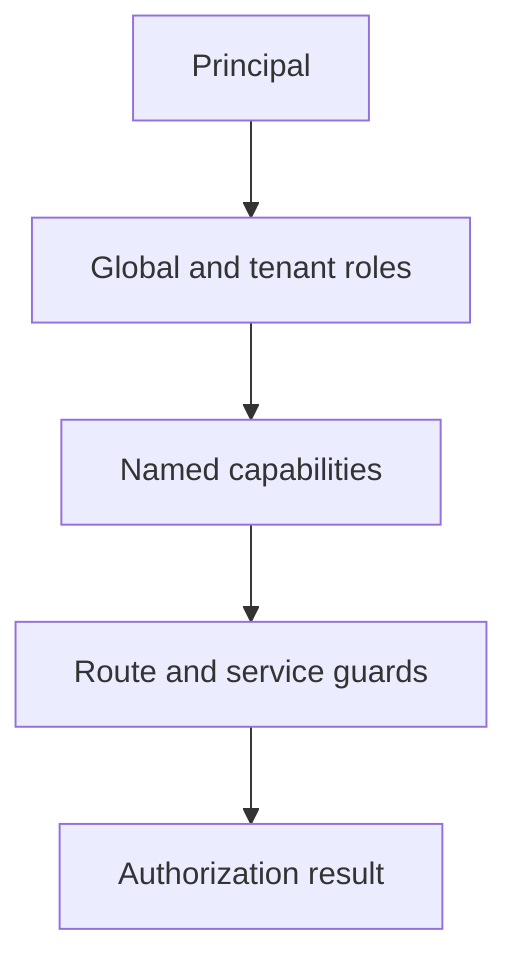

# ADR-0009: Capability-based authorization layer

- **Status:** Accepted
- **Date:** 2026-06-23
- **Related:** #269 (RW-011), #247 (RW-E002), #318 (RW-060, tenant model)

## Authorization decision

## Context

ReadWise historically authorized with a two-value `Role` enum (`Admin`,
`Reader`) and hard-coded `role === "Admin"` checks across pages and routes. The
global enum now also includes scoped admin roles (`Moderator`, `ContentEditor`,
`SupportAgent`). The product also has tenant-level roles for organizations and
classrooms (teachers, organization admins, students). Hard-coded system-role
checks do not scale across these axes, so ReadWise needs an extensible permission
model that preserves existing Admin/Reader behavior while allowing scoped
delegation.

## Decision

Introduce a **capability layer in code** (`src/lib/rbac.ts`) and gate features on
named capabilities (e.g. `articles.manage`) instead of roles. The module defines
the capabilities, active global roles, tenant roles, and a role → capability
mapping. `hasCapability(principal, capability)` is the single runtime check;
`requireCapability` (pages) and `requireCapabilityApi` (routes) wrap it.
Top-level admin access uses the `admin.access` capability directly. Capabilities
live in code, and the DB-backed role migration process is documented
(`docs/access/rbac.md`). A compile-time guard keeps `ACTIVE_ROLES` in sync with
the Prisma enum.

## Alternatives considered

- **Add all possible roles to the `Role` enum immediately:** Premature; tenant
  roles and future global roles should become assignable only when product
  requirements are settled.
- **Full DB-backed Role/Capability/RoleCapability tables now:** Overengineered
  for a two-role app; adds schema, queries, and admin UI before they are needed.
- **Keep hard-coded `role === "Admin"` checks:** Does not support new roles
  without touching every gate; exactly the problem to be solved.

## Consequences

- Positive: new admin features are gated by named capabilities; adding a role is
  a one-line mapping change; existing behavior is provably preserved (tests).
- Trade-off: capabilities are static in code until a future migration; per-user
  custom grants are not possible yet.
- Risk: the in-code map and the Prisma enum could drift — mitigated by the
  compile-time guard and `docs/access/rbac.md`.

## Current status

- Global DB-backed roles are `Admin`, `Reader`, `Moderator`, `ContentEditor`,
  and `SupportAgent`.
- Tenant roles are stored separately on organization/classroom membership
  models, not in `User.role`.
- Additional global system roles require an explicit enum + `ACTIVE_ROLES`
  change when they become active product roles.

