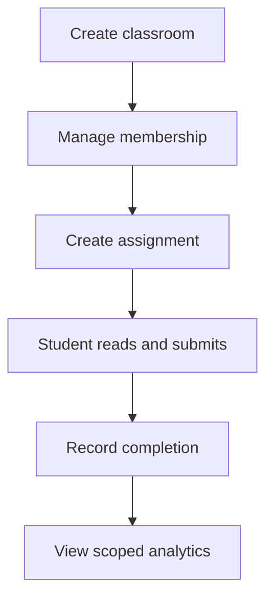

# Teacher workflows and assignments

Teacher workflows are the learner-facing education layer on top of the Access
subsystem's multi-tenant organization and classroom model. Access owns roles and
authorization; Learning owns the study/assignment experience and completion
signals.

## Teacher workflow


## Code map

| Area | Code | Purpose |
| --- | --- | --- |
| Teacher landing | `src/app/(app)/teacher/page.tsx` | Teacher classroom overview. |
| Classroom detail | `src/app/(app)/teacher/classrooms/[id]/page.tsx` | Roster, assignments, analytics, and classroom actions. |
| Student assignments | `src/app/(app)/assignments/page.tsx` | Authenticated learner view of assigned readings. |
| Classroom APIs | `/api/classrooms`, `/api/classrooms/[id]/members`, `/api/classrooms/[id]/assignments`, `/api/classrooms/[id]/analytics` | Create/manage classrooms, roster, assignments, analytics. |
| Assignment API | `/api/assignments/[id]/completion` | Student completion/quiz-score status update. |
| Access model | `Organization`, `Membership`, `Classroom`, `ClassroomMembership`, `Assignment`, `AssignmentCompletion` | Tenant/classroom data model in Prisma. |
| RBAC | `src/lib/rbac.ts`, `docs/access/rbac.md` | Tenant/classroom capability resolution. |
| Tests | `tests/classroom*.test.ts`, `tests/assignment*.test.ts`, `e2e/teacher-classroom.spec.ts` | Authorization, route, query, progress, and e2e coverage. |

## Role boundary

- `OrgAdmin` and `Teacher` are tenant roles, not global `Admin` roles.
- Teachers manage their classrooms and assignments within their organization.
- Students see only their own assignment state.
- Global admin-only article/tag/member operations remain separate and must not be
  exposed through teacher workflows.

## Classroom lifecycle

A teacher can create a classroom in an organization where they have the required
membership/capability. A classroom has:

- `orgId`;
- `name`;
- `teacherId`;
- roster entries in `ClassroomMembership`.

Roster changes are scoped to the classroom. Adding a student should not grant
system admin privileges or visibility into unrelated classrooms.

## Assignment lifecycle

Assignments link a classroom to an article with optional due date and
instructions. Current lifecycle:

1. Teacher selects an accessible article and creates an assignment.
2. Students in the classroom see the assignment in `/assignments`.
3. Student reading/progress/quiz activity can update `AssignmentCompletion`.
4. Teacher analytics read aggregate and per-student status for that classroom.
5. Teachers can filter classroom analytics by assignment/student, inspect
   drilldown rows, and export the privacy-scoped view as CSV or JSON.

After the route authorizes classroom management, it calls
`createArticleAssignment` in
`src/lib/classroom/article-assignments.ts`. That workflow asks Article Library
to validate organization assignability before parsing the optional due date,
normalizes blank instructions to `null`, and creates the row. This preserves
Article Library's controlled `404`/`409` integrity outcomes ahead of due-date
validation; the route only maps the result to HTTP.

`AssignmentStatus` values are controlled by the Prisma enum:

```text
assigned, in_progress, completed
```

Completion rows are unique per `(assignmentId, studentId)`.

## Article access and IDOR safety

Assignment creation and student display must use Article Library access helpers,
not hand-rolled visibility checks. A teacher assigning an article does not make
private or unpublished article content globally visible. Student routes must
verify the authenticated user is the assigned student or an authorized teacher
for the classroom.

## Analytics

Classroom analytics are tenant-scoped education reports, not product analytics
events. They may show per-learner assignment/completion/quiz status to authorized
teachers. They must not leak:

- article text;
- selected text/highlight notes;
- prompts or AI responses;
- private user data outside the classroom.

Aggregate teacher/admin visibility rules are documented in
`analytics/tenant-reporting-privacy.md`.

`GET /api/classrooms/[id]/analytics` accepts optional `assignmentId` and
`studentId` filters. `GET /api/classrooms/[id]/analytics/export` accepts the
same filters plus `format=csv|json`. Classroom teachers and system admins receive
the same per-student/drilldown fields visible in the UI; org admins continue to
receive aggregate-only exports with individual rows redacted.

## Deletion and retention

- Deleting a user cascades their classroom memberships and assignment completions.
- Deleting a classroom cascades assignments and completions.
- Assignment completion is user/classroom education data and should be included
  in account export/deletion logic according to the data-lifecycle matrix.

## Related docs

- [`../access/multi-tenancy.md`](../access/multi-tenancy.md) — tenant model, memberships, classroom schema, and cache keys.
- [`../access/rbac.md`](../access/rbac.md) — capability resolution.
- [`../analytics/tenant-reporting-privacy.md`](../analytics/tenant-reporting-privacy.md) — teacher/admin reporting visibility.
- [`learning-and-mastery.md`](./learning-and-mastery.md) — mastery and quiz signals that can appear in assignment analytics.

