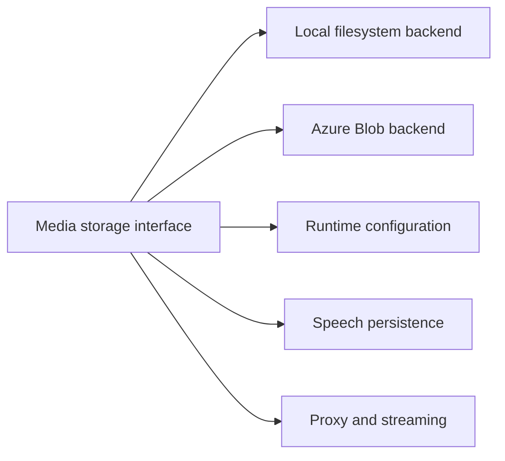

# Media storage

Audio narration (text-to-speech) is the largest media payload ReadWise produces.
Current speech audio is stored outside the relational database in either local
filesystem storage or Azure Blob Storage. The legacy database-backed
`ArticleSpeech.audioBase64` fallback has been removed; current `ArticleSpeech`
rows retain only word timings. `MediaAsset` is the canonical audio pointer.

## Storage architecture


## Goals

- Keep large audio out of the primary database.
- Provide a local default that works in development and single-node deployments
  without cloud infrastructure.
- Support Azure Blob Storage for production or multi-node deployments.
- Make reader playback work identically regardless of the selected backend.
- Degrade gracefully when an optional storage provider is unavailable: speech
  audio is not cached, but the app does not fall back to database audio storage.

## Configuration

A single env var selects the backend (`src/lib/storage.ts`):

| `MEDIA_STORAGE` | Backend | Notes |
| --- | --- | --- |
| unset / `local` | Local filesystem | Default. Files live under `MEDIA_STORAGE_DIR` (default `./.media`). |
| `filesystem` | Local filesystem | Legacy alias for `local`. |
| `azure` | Azure Blob Storage | Requires `AZURE_STORAGE_CONNECTION_STRING` or `AZURE_STORAGE_ACCOUNT` + `AZURE_STORAGE_KEY`. |

`MEDIA_STORAGE=database` is no longer supported. If an old environment still
sets it, runtime config reports a warning and the storage resolver uses local
filesystem storage instead.

### Local storage

| Variable | Default | Description |
| --- | --- | --- |
| `MEDIA_STORAGE` | _(unset)_ | Optional; set to `local` explicitly when desired. |
| `MEDIA_STORAGE_DIR` | `./.media` | Absolute or relative path for the local file store. |

### Azure Blob Storage

| Variable | Required | Description |
| --- | --- | --- |
| `MEDIA_STORAGE` | yes | Set to `azure`. |
| `AZURE_STORAGE_CONNECTION_STRING` | one of these two auth options | Full Azure Storage connection string. |
| `AZURE_STORAGE_ACCOUNT` | alternative to connection string | Azure Storage account name. |
| `AZURE_STORAGE_KEY` | with account name | Azure Storage account key. |
| `AZURE_STORAGE_CONTAINER` | no | Blob container name. The runtime fallback is `media`; `.env.example` explicitly selects `tts` for fresh template-based environments. |

Keep an existing deployment on its current container unless its stored objects
are migrated deliberately. Changing only `AZURE_STORAGE_CONTAINER` makes
existing `MediaAsset.storageKey` values resolve against a different container
and therefore appear unavailable.

When `MEDIA_STORAGE=azure` but credentials are missing, `getMediaStorage()`
returns `null`, readiness reports `checks.providers.storage = "degraded"`, and
speech audio is not persisted until storage is configured. The app does **not**
write audio into the database as a fallback.

## The storage abstraction

```ts
interface MediaStorage {
  readonly kind: MediaStorageKind; // "local" | "azure"
  put(input: PutMediaInput): Promise<PutMediaResult>; // → { storageKey, sizeBytes, checksum }
  get(storageKey: string): Promise<Buffer | null>;
  delete(storageKey: string): Promise<void>;
}
```

Both local and Azure implementations are:

- **content-addressed** — object keys embed the SHA-256 of the bytes
  directly, or a deterministic 128-bit digest of the owner scope plus SHA-256
  (`<keyHint>/<digest128><ext>`), so repeated writes are idempotent.
- **article-scoped for speech assets** — narration uses
  `speech/<digest128><ext>`, where the digest includes `articleId`, so article
  deletion cannot remove bytes
  referenced by a different article with identical audio.
- **traversal-safe** — local storage confines all keys to the base directory;
  Azure uses container scoping and sanitized keys.
- **private** — Azure blobs are uploaded without public access; audio is served
  only to authenticated readers via `GET /api/reader/[id]/speech/audio`.

To add another backend, implement `MediaStorage` and register it behind a new
`MEDIA_STORAGE` value. Speech generation and playback go through this interface.

## How speech uses storage

`src/lib/speech/index.ts` `getOrCreateArticleSpeech`:

- **Synthesis path** — new audio is written through `getMediaStorage().put()`.
  A `MediaAsset` row records the canonical `storageKey`, `mimeType`, `voice`, and
  `articleId`; `ArticleSpeech.mediaAssetId` identifies the object matching its
  word timings. Superseded objects retain their own rows for lifecycle cleanup.
- **Storage unavailable/write failure** — the request returns a graceful
  `storage_unavailable` fallback because no authenticated audio URL can serve
  transient bytes. No database audio fallback or cache row is created.
- **Cached-read path** — `resolveStoredSpeechMediaMetadata` loads the linked
  current `MediaAsset` without reading its bytes. The authenticated audio route
  is the only request that reads the object from storage.

## Streaming audio endpoint

`GET /api/reader/[id]/speech/audio` serves narration audio bytes directly:

- **Auth-gated** — same article-access rules as the speech POST route.
- **Storage-backed** — serves from `storageKey` via `getMediaStorage().get()`.
  Returns 404 when no row/key/object is available.
- **Cache headers** — `Cache-Control: private, max-age=3600` prevents shared
  caches from serving one user's audio to another.
- **Content-Length** — included when bytes are known, enabling progress bars.
- **Seeking** — advertises `Accept-Ranges: bytes`; valid single byte ranges
  return `206 Partial Content` with `Content-Range`, while unsatisfiable ranges
  return `416` with the complete object length.

The speech POST returns this URL with narration timing metadata. The Reader uses
it directly as `<audio src>`, avoiding base64 encoding and duplicate audio-byte
reads during the metadata request.

## Readiness probe

`GET /api/ready` exposes `checks.providers.storage`:

| Value | Meaning |
| --- | --- |
| `configured` | Local storage is active, or Azure credentials are present. |
| `degraded` | Azure was selected without credentials, or an unsupported storage value was supplied and local fallback is being used. |

Storage degradation does not make readiness return HTTP 503 because storage is
optional and speech gracefully skips caching when a provider is unavailable. No
secret values (connection strings, account keys) are included in readiness JSON.

## Troubleshooting

| Symptom | Likely cause | Resolution |
| --- | --- | ---------- |
| `checks.providers.storage = "degraded"` in `/api/ready` | `MEDIA_STORAGE=azure` but `AZURE_STORAGE_*` credentials are missing. | Set `AZURE_STORAGE_CONNECTION_STRING` or `AZURE_STORAGE_ACCOUNT` + `AZURE_STORAGE_KEY`, or switch to `MEDIA_STORAGE=local`. |
| `storage.azure_unconfigured` warn in logs | Same as above. | Same as above. |
| `storage.azure_container_unavailable` warn in logs | Azure SDK import failed or container creation threw. | Check credentials, network, and account/container names. |
| Speech POST returns no cached audio on later requests | Storage write failed or the storage object is unavailable. | Check storage logs and `GET /api/ready`; regenerate narration after storage is healthy. |
| Audio endpoint returns 404 but a `MediaAsset` is linked | The selected backend cannot read the asset's object. | Confirm env vars are loaded and the local directory/blob container contains the asset's key. |

