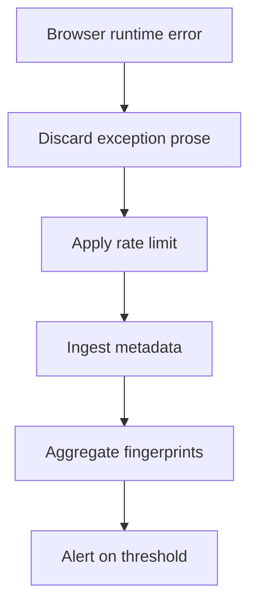

# Client-error reporting

Client-error reporting funnels browser runtime errors into the same structured
server-side observability path as API, worker, and provider failures. It is
public, rate-limited, best-effort, and privacy-scrubbed.

## Client error pipeline

## Code map

| Area | Code | Purpose |
| --- | --- | --- |
| API endpoint | `src/app/api/client-errors/route.ts` | Validates/scrubs browser error reports and returns `204`. |
| Browser reporter | `src/components/ClientErrorReporter.tsx` | Posts runtime errors/unhandled rejections from the client. |
| Error aggregation | `src/lib/observability/errors.ts` | Fingerprinting, redaction, metrics, and alert hook. |
| Rate limiting | `src/lib/security/rate-limit/index.ts` | IP-keyed public limiter for the endpoint. |

## Endpoint contract

`POST /api/client-errors` accepts:

| Field | Rule |
| --- | --- |
| `message` | Required non-empty string, max 2000 chars. |
| `source` | Optional string, max 100 chars. |
| `stack` | Optional string, max 8000 chars, not trimmed. |
| `url` | Optional string, max 2000 chars. |

The endpoint always returns `204 No Content`, including when rate-limited. This
keeps client pages from learning or depending on observability internals and
prevents reporting failures from breaking the user experience.

## Scrubbing and privacy

The route treats the browser payload as untrusted and persists none of its
exception prose. The required `message` is accepted for backwards-compatible
ingestion but discarded before logging and aggregation. The optional stack is
used only to derive a safe top-frame filename through the backend error policy;
the raw stack is not logged or exported.

Defense-in-depth handling also ensures:

- email-like values become `[email]`,
- long token-like strings become `[token]`,
- URL query strings and hashes are stripped,
- `captureError` applies the backend redaction/fingerprinting rules again,
- structured `client.error` logs contain only a controlled failure reason,
  client source, and low-cardinality route group.

Never add article text, selected text, prompts, translations, definitions,
cookies, authorization headers, or profile data to the client report body.

## Rate limiting

The endpoint uses the public rate-limit bucket keyed by trusted client IP. On
limit failure it still returns `204` and drops the report silently. This makes
the endpoint safe to call from global error handlers without exposing abuse
controls to clients.

## Aggregation and alerting

After route-level scrubbing, the endpoint creates a synthetic `ClientError` and
passes it to `captureError` with context:

- `source: "client"`,
- severity `error`,
- sanitized route/path,
- `clientSource` metadata.

The backend aggregator computes a fingerprint, increments error metrics, emits
structured logs, and triggers the configured alert hook when thresholds are met.
See [`overview.md`](./overview.md) for the broader error pipeline.

## Operational checks

- Search logs for `client.error` to inspect controlled source and route metadata.
- Search `error.captured` by fingerprint to group client and server occurrences.
- Use the sanitized route/path to correlate with frontend deployments and recent
  UI changes.
- Keep the endpoint public and best-effort; do not add authentication or user
  content to the payload.

## Tests

Route behavior is covered by observability/client-error route tests and the
shared error-redaction tests in `tests/observability*.test.ts` where present.
