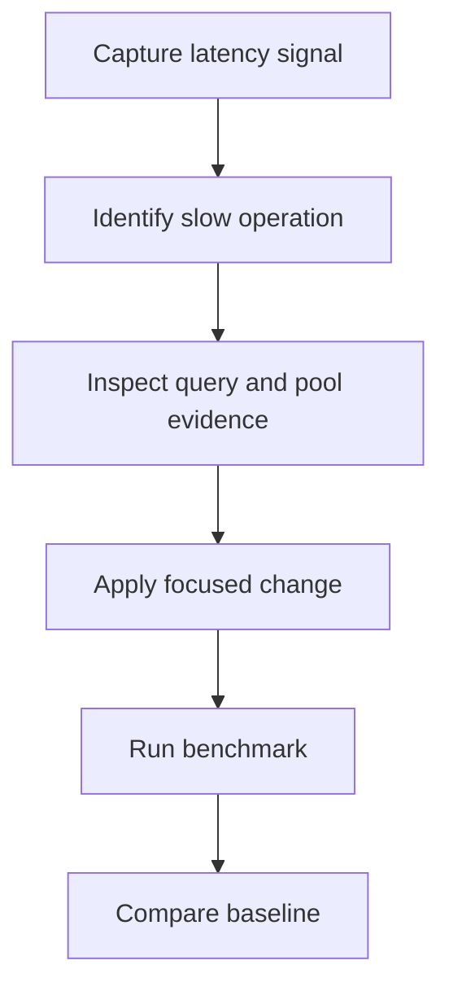

# Performance tuning

## Performance tuning loop


## App-side database metrics

ReadWise times Prisma operations in `src/lib/prisma.ts` by default and exports
content-free metrics from `GET /api/admin/metrics`:

| Metric | Meaning |
| --- | --- |
| `readwise_db_queries_total` | Prisma operations by provider/model/operation/outcome. |
| `readwise_db_query_duration_ms` | Duration histogram for the same label set. |
| `readwise_db_slow_queries_total` | Operations at or above `DB_SLOW_QUERY_THRESHOLD_MS`. |

Knobs:

- `DB_QUERY_TIMING_ENABLED=true` by default; set `false`, `0`, `off`, or `no` to
  disable the wrapper.
- `DB_SLOW_QUERY_THRESHOLD_MS=250` by default.

The app never logs SQL text, bind parameters, Prisma args, article text, prompts,
selected text, user ids, or raw ids for these metrics. Slow-query log lines only
include provider/model/operation/outcome, duration, and threshold.

## PostgreSQL slow-query logging

Use PostgreSQL server logs to identify exact SQL in a secured operator-only
environment:

```sql
ALTER SYSTEM SET log_min_duration_statement = '250ms';
SELECT pg_reload_conf();
```

Tune the threshold to match the app-side `DB_SLOW_QUERY_THRESHOLD_MS`. Keep
database logs access-controlled because SQL statements can reveal schema shape
and, depending on driver/settings, may include sensitive literals.

## pg_stat_statements

Enable `pg_stat_statements` on PostgreSQL environments where extensions are
allowed:

```sql
CREATE EXTENSION IF NOT EXISTS pg_stat_statements;
```

Then inspect normalized statements by aggregate cost:

```sql
SELECT calls, total_exec_time, mean_exec_time, max_exec_time, rows, query
FROM pg_stat_statements
ORDER BY mean_exec_time DESC
LIMIT 20;
```

Use this with app metrics: the app shows which Prisma model/operation is slow;
`pg_stat_statements` shows the normalized SQL family to tune with indexes or
query rewrites.

## Pooling and connection limits

For managed PostgreSQL, size Prisma connection usage below the database max
connections and reserve headroom for migrations, admin tools, and background
workers. If using PgBouncer, prefer transaction pooling for stateless request
traffic and validate prepared-statement compatibility with the Prisma/adapter
version in staging.

Common deployment levers:

- Add `connection_limit=<n>` to the PostgreSQL connection URL when the platform
  needs a hard Prisma pool cap.
- Run workers with a separate connection budget from web/API processes.
- Keep migration jobs out of the request pool.

## Listing/feed benchmark

Use the guarded local benchmark for listing paths:

```bash
npm run benchmark:listings -- --iterations 10 --limit 12 --cold
```

Add a personalized feed run only with a non-sensitive test user id:

```bash
npm run benchmark:listings -- --iterations 10 --user-id <test-user-id>
```

The command refuses non-SQLite `DATABASE_URL` values unless
`READWISE_BENCHMARK_ALLOW_REMOTE_DB=1` is set. It prints only aggregate timing
and row counts, never article content, SQL, user ids, credentials, or database
URLs. Use `--cold` to set `READWISE_DISABLE_LISTING_CACHE=1` for cache-cold
comparisons, then compare with the normal cached run.

