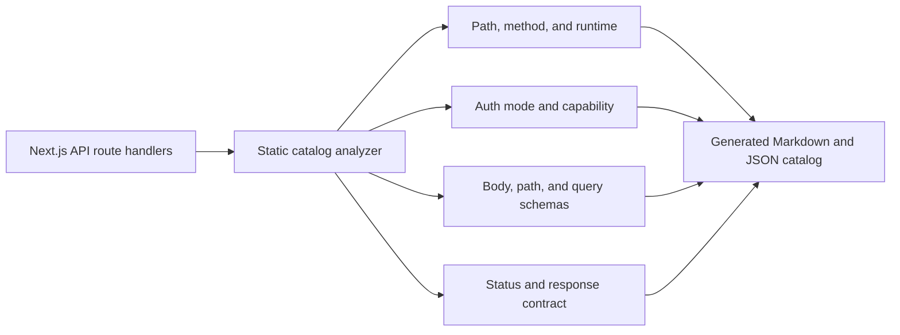

# ReadWise API Catalog

> Auto-generated by `npm run api-catalog` — do not edit by hand.
> Last generated: 2026-07-21T02:52:45.720Z

**136 routes · 165 method handlers**

## Catalog generation model

## Legend

| Symbol | Meaning |
|--------|---------|
| 🔓 public | No authentication required |
| 🔐 session | Authenticated user session required |
| 🛡️ admin | Admin role required |
| ⚡ capability | Named RBAC capability required |
| `B` | Body schema validated |
| `P` | Path params schema validated |
| `Q` | Query schema validated |

## Routes

| Path | Method | Auth | Schemas | Status | Response | Runtime | Notes |
|------|--------|------|---------|--------|----------|---------|-------|
| `/api/account` | DELETE | 🔐 session | — | 204 | JSON |  |  |
| `/api/account/export` | GET | 🔐 session | — | 200 | JSON download |  |  |
| `/api/admin/ai/usage` | GET | ⚡ capability | `Q` | 200 | JSON |  | capability: CAPABILITIES.analyticsView |
| `/api/admin/analytics` | GET | ⚡ capability | — | 200 | JSON |  | capability: CAPABILITIES.analyticsView |
| `/api/admin/analytics/export` | GET | ⚡ capability | `Q` | 200 | mixed |  | capability: CAPABILITIES.analyticsView |
| `/api/admin/articles` | GET | ⚡ capability | `Q` | 200 | JSON |  | capability: CAPABILITIES.articlesManage |
| `/api/admin/articles/{id}` | DELETE | ⚡ capability | `P` | 200 | JSON |  | capability: CAPABILITIES.articlesManage |
| `/api/admin/articles/{id}/force-rescrape` | GET | ⚡ capability | `P` | 200 | JSON |  | capability: CAPABILITIES.sourcesManage |
| `/api/admin/articles/{id}/force-rescrape` | POST | ⚡ capability | `B` `P` | 200 | JSON |  | capability: CAPABILITIES.sourcesManage |
| `/api/admin/articles/{id}/rebuild` | POST | ⚡ capability | `P` | 200 | JSON |  | capability: CAPABILITIES.articlesManage |
| `/api/admin/articles/{id}/review` | POST | ⚡ capability | `B` `P` | 200 | JSON |  | capability: CAPABILITIES.contentModerate |
| `/api/admin/articles/{id}/takedown` | POST | ⚡ capability | `B` `P` | 200 | JSON |  | capability: CAPABILITIES.contentModerate |
| `/api/admin/articles/ingest` | POST | ⚡ capability | `B` | 201 | JSON | nodejs | capability: CAPABILITIES.articlesManage |
| `/api/admin/audit-logs` | GET | ⚡ capability | `Q` | 200 | JSON |  | capability: CAPABILITIES.securityView |
| `/api/admin/backfill` | GET | ⚡ capability | `Q` | 200 | JSON |  | capability: CAPABILITIES.sourcesManage |
| `/api/admin/backfill` | POST | ⚡ capability | `B` | 200 | JSON |  | capability: CAPABILITIES.sourcesManage |
| `/api/admin/backfill/{id}` | GET | ⚡ capability | `P` | 200 | JSON |  | capability: CAPABILITIES.sourcesManage |
| `/api/admin/backfill/{id}` | POST | ⚡ capability | `B` `P` | 200 | JSON |  | capability: CAPABILITIES.sourcesManage |
| `/api/admin/candidates` | GET | ⚡ capability | `Q` | 200 | JSON |  | capability: CAPABILITIES.sourcesManage |
| `/api/admin/candidates/{id}` | GET | ⚡ capability | `P` | 200 | JSON |  | capability: CAPABILITIES.sourcesManage |
| `/api/admin/candidates/{id}/review` | POST | ⚡ capability | `B` `P` | 200 | JSON |  | capability: CAPABILITIES.sourcesManage |
| `/api/admin/candidates/review` | POST | ⚡ capability | `B` | 200 | JSON |  | capability: CAPABILITIES.sourcesManage |
| `/api/admin/canonical-conflicts` | GET | ⚡ capability | `Q` | 200 | JSON |  | capability: CAPABILITIES.sourcesManage |
| `/api/admin/canonical-conflicts/{id}` | GET | ⚡ capability | `P` | 200 | JSON |  | capability: CAPABILITIES.sourcesManage |
| `/api/admin/canonical-conflicts/{id}/resolve` | POST | ⚡ capability | `B` `P` | 200 | JSON |  | capability: CAPABILITIES.sourcesManage |
| `/api/admin/deleted-articles` | GET | ⚡ capability | `Q` | 200 | JSON |  | capability: CAPABILITIES.sourcesManage |
| `/api/admin/deleted-articles/{id}/recover` | POST | ⚡ capability | `B` `P` | 200 | JSON |  | capability: CAPABILITIES.sourcesManage |
| `/api/admin/discovery-sources` | GET | ⚡ capability | `Q` | 200 | JSON |  | capability: CAPABILITIES.sourcesManage |
| `/api/admin/discovery-sources/{id}` | GET | ⚡ capability | `P` | 200 | JSON |  | capability: CAPABILITIES.sourcesManage |
| `/api/admin/discovery-sources/{id}/lifecycle` | POST | ⚡ capability | `B` `P` | 200 | JSON |  | capability: CAPABILITIES.sourcesManage |
| `/api/admin/discovery-sources/{id}/trust` | GET | ⚡ capability | `P` | 200 | JSON |  | capability: CAPABILITIES.sourcesManage |
| `/api/admin/discovery-sources/{id}/trust` | POST | ⚡ capability | `B` `P` | 200 | JSON |  | capability: CAPABILITIES.sourcesManage |
| `/api/admin/jobs` | GET | ⚡ capability | `Q` | 200 | JSON |  | capability: CAPABILITIES.jobsManage |
| `/api/admin/jobs/{id}` | POST | ⚡ capability | `B` `P` | 200 | JSON |  | capability: CAPABILITIES.jobsManage |
| `/api/admin/jobs/backfill` | POST | ⚡ capability | `B` | 200 | JSON |  | capability: CAPABILITIES.jobsManage |
| `/api/admin/members/{id}` | DELETE | ⚡ capability | `P` | 200 | JSON |  | capability: CAPABILITIES.membersManage |
| `/api/admin/members/{id}` | PATCH | ⚡ capability | `B` `P` | 200 | JSON |  | capability: CAPABILITIES.membersManage |
| `/api/admin/members/{id}/support` | POST | ⚡ capability | `B` `P` | 200 | JSON |  | capability: CAPABILITIES.supportAssist |
| `/api/admin/metrics` | GET | ⚡ capability | — | 200 | text/plain |  | capability: CAPABILITIES.securityView |
| `/api/admin/organizations` | GET | ⚡ capability | `Q` | 200 | JSON |  | capability: CAPABILITIES.organizationsManage |
| `/api/admin/organizations` | POST | ⚡ capability | `B` | 201 | JSON |  | capability: CAPABILITIES.organizationsManage |
| `/api/admin/organizations/{id}` | GET | ⚡ capability | `P` | 200 | JSON |  | capability: CAPABILITIES.organizationsManage |
| `/api/admin/reports` | GET | ⚡ capability | — | 200 | JSON |  | capability: CAPABILITIES.contentModerate |
| `/api/admin/reports/{id}` | PATCH | ⚡ capability | `B` `P` | 200 | JSON |  | capability: CAPABILITIES.contentModerate |
| `/api/admin/scrape/trigger` | POST | ⚡ capability | `B` | 200 | JSON | nodejs | capability: CAPABILITIES.sourcesManage |
| `/api/admin/security/events` | GET | ⚡ capability | `Q` | 200 | JSON |  | capability: CAPABILITIES.securityView |
| `/api/admin/series` | GET | ⚡ capability | — | 200 | JSON |  | capability: CAPABILITIES.articlesManage |
| `/api/admin/series` | POST | ⚡ capability | `B` | 201 | JSON |  | capability: CAPABILITIES.articlesManage |
| `/api/admin/series/{id}` | GET | ⚡ capability | `P` | 200 | JSON |  | capability: CAPABILITIES.articlesManage |
| `/api/admin/series/{id}` | DELETE | ⚡ capability | `P` | 200 | JSON |  | capability: CAPABILITIES.articlesManage |
| `/api/admin/series/{id}` | PATCH | ⚡ capability | `B` `P` | 200 | JSON |  | capability: CAPABILITIES.articlesManage |
| `/api/admin/series/{id}/reorder` | POST | ⚡ capability | `B` `P` | 200 | JSON |  | capability: CAPABILITIES.articlesManage |
| `/api/admin/slo` | GET | ⚡ capability | — | 200 | JSON |  | capability: CAPABILITIES.securityView |
| `/api/admin/sources` | GET | ⚡ capability | — | 200 | JSON |  | capability: CAPABILITIES.sourcesManage |
| `/api/admin/sources/{key}` | PATCH | ⚡ capability | `B` `P` | 200 | JSON |  | capability: CAPABILITIES.sourcesManage |
| `/api/admin/sources/{key}/crawl-runs` | GET | ⚡ capability | `P` `Q` | 200 | JSON |  | capability: CAPABILITIES.sourcesManage |
| `/api/admin/sources/sync` | POST | ⚡ capability | — | 200 | JSON |  | capability: CAPABILITIES.sourcesManage |
| `/api/admin/stats` | GET | ⚡ capability | — | 200 | JSON |  | capability: CAPABILITIES.adminAccess |
| `/api/admin/tags` | GET | ⚡ capability | — | 200 | JSON |  | capability: CAPABILITIES.tagsManage |
| `/api/admin/tags/{id}` | DELETE | ⚡ capability | `P` | 200 | JSON |  | capability: CAPABILITIES.tagsManage |
| `/api/admin/tags/{id}` | PATCH | ⚡ capability | `B` `P` | 200 | JSON |  | capability: CAPABILITIES.tagsManage |
| `/api/admin/tags/{id}/merge` | POST | ⚡ capability | `B` `P` | 200 | JSON |  | capability: CAPABILITIES.tagsManage |
| `/api/articles` | GET | 🔐 session | `Q` | 200 | JSON |  |  |
| `/api/articles/import` | GET | 🔐 session | `Q` | 200 | JSON | nodejs |  |
| `/api/articles/import` | POST | 🔐 session | `B` | 200 | JSON | nodejs |  |
| `/api/assignments/{id}` | DELETE | 🔐 session | `P` | 200 | JSON |  |  |
| `/api/assignments/{id}` | PATCH | 🔐 session | `B` `P` | 200 | JSON |  |  |
| `/api/assignments/{id}/completion` | POST | 🔐 session | `B` `P` | 201 | JSON |  |  |
| `/api/auth/{...nextauth}` | GET | 🔓 public | — | 200 | NextAuth |  | NextAuth.js handler — manages OAuth/credentials sessions |
| `/api/auth/{...nextauth}` | POST | 🔓 public | — | 200 | NextAuth |  | NextAuth.js handler — manages OAuth/credentials sessions |
| `/api/bookmarks/membership` | GET | 🔐 session | `Q` | 200 | JSON |  |  |
| `/api/bookmarks/toggle` | POST | 🔐 session | `B` | 200 | JSON |  |  |
| `/api/classrooms` | GET | 🔐 session | — | 200 | JSON |  |  |
| `/api/classrooms` | POST | 🔐 session | `B` | 201 | JSON |  |  |
| `/api/classrooms/{id}` | GET | 🔐 session | `P` | 200 | JSON |  |  |
| `/api/classrooms/{id}` | DELETE | 🔐 session | `P` | 200 | JSON |  |  |
| `/api/classrooms/{id}` | PATCH | 🔐 session | `B` `P` | 200 | JSON |  |  |
| `/api/classrooms/{id}/analytics` | GET | 🔐 session | `P` `Q` | 200 | JSON |  |  |
| `/api/classrooms/{id}/analytics/export` | GET | 🔐 session | `P` `Q` | 200 | mixed |  |  |
| `/api/classrooms/{id}/article-options` | GET | 🔐 session | `P` `Q` | 200 | JSON |  |  |
| `/api/classrooms/{id}/assignments` | POST | 🔐 session | `B` `P` | 201 | JSON |  |  |
| `/api/classrooms/{id}/members` | POST | 🔐 session | `B` `P` | 201 | JSON |  |  |
| `/api/classrooms/{id}/members/{userid}` | DELETE | 🔐 session | `P` | 200 | JSON |  |  |
| `/api/classrooms/{id}/student-candidates` | GET | 🔐 session | `P` `Q` | 200 | JSON |  |  |
| `/api/client-errors` | POST | 🔓 public | `B` | 204 | JSON |  |  |
| `/api/coach-memory` | DELETE | 🔐 session | — | 204 | JSON |  |  |
| `/api/dictionary` | POST | 🔐 session | `B` | 200 | JSON |  |  |
| `/api/feed` | GET | 🔐 session | `Q` | 200 | JSON |  |  |
| `/api/gamification/summary` | GET | 🔐 session | — | 200 | JSON |  |  |
| `/api/health` | GET | 🔓 public | — | 200 | JSON |  |  |
| `/api/highlights/{id}` | DELETE | 🔐 session | `P` | 200 | JSON |  |  |
| `/api/highlights/{id}` | PATCH | 🔐 session | `B` `P` | 200 | JSON |  |  |
| `/api/highlights/{id}/review-card` | POST | 🔐 session | `P` | 200 | JSON |  |  |
| `/api/level-recommendation` | GET | 🔐 session | — | 200 | JSON |  |  |
| `/api/lists` | GET | 🔐 session | — | 200 | JSON |  |  |
| `/api/lists` | POST | 🔐 session | `B` | 201 | JSON |  |  |
| `/api/lists/{id}` | DELETE | 🔐 session | `P` | 200 | JSON |  |  |
| `/api/lists/{id}` | PATCH | 🔐 session | `B` `P` | 200 | JSON |  |  |
| `/api/lists/{id}/items` | POST | 🔐 session | `B` `P` | 200 | JSON |  |  |
| `/api/lists/{id}/items/{articleId}` | DELETE | 🔐 session | `P` | 200 | JSON |  |  |
| `/api/onboarding` | POST | 🔐 session | `B` | 200 | JSON |  |  |
| `/api/orgs` | GET | 🔐 session | — | 200 | JSON |  |  |
| `/api/orgs` | POST | 🔐 session | `B` | 201 | JSON |  |  |
| `/api/orgs/{id}` | GET | 🔐 session | `P` | 200 | JSON |  |  |
| `/api/orgs/{id}/members` | GET | 🔐 session | `P` | 200 | JSON |  |  |
| `/api/orgs/{id}/members` | POST | 🔐 session | `B` `P` | 201 | JSON |  |  |
| `/api/orgs/{id}/members/{memberid}` | DELETE | 🔐 session | `P` | 200 | JSON |  |  |
| `/api/orgs/{id}/members/{memberid}` | PATCH | 🔐 session | `B` `P` | 200 | JSON |  |  |
| `/api/placement` | GET | 🔐 session | `Q` | 200 | JSON |  |  |
| `/api/placement` | POST | 🔐 session | `B` | 200 | JSON |  |  |
| `/api/profile` | PUT | 🔐 session | `B` | 200 | JSON |  |  |
| `/api/progress/batch` | POST | 🔐 session | `B` | 200 | JSON |  |  |
| `/api/pronunciation/attempt` | POST | 🔐 session | `B` | 200 | JSON |  |  |
| `/api/pronunciation/history` | GET | 🔐 session | `Q` | 200 | JSON |  |  |
| `/api/push/preferences` | GET | 🔐 session | — | 200 | JSON |  |  |
| `/api/push/preferences` | PUT | 🔐 session | `B` | 200 | JSON |  |  |
| `/api/push/subscribe` | POST | 🔐 session | `B` | 201 | JSON |  |  |
| `/api/push/unsubscribe` | POST | 🔐 session | `B` | 200 | JSON |  |  |
| `/api/push/vapid-public-key` | GET | 🔓 public | — | 200 | JSON |  |  |
| `/api/quiz/mastery` | GET | 🔐 session | — | 200 | JSON |  |  |
| `/api/reader/{id}/difficulty-feedback` | POST | 🔐 session | `B` `P` | 200 | JSON |  |  |
| `/api/reader/{id}/grammar` | POST | 🔐 session | `B` `P` | 200 | JSON |  |  |
| `/api/reader/{id}/highlights` | GET | 🔐 session | `P` | 200 | JSON |  |  |
| `/api/reader/{id}/highlights` | POST | 🔐 session | `B` `P` | 201 | JSON |  |  |
| `/api/reader/{id}/offline` | GET | 🔐 session | `P` `Q` | 200 | JSON |  |  |
| `/api/reader/{id}/progress` | POST | 🔐 session | `B` `P` | 200 | JSON |  |  |
| `/api/reader/{id}/quiz` | POST | 🔐 session | `P` | 200 | JSON |  |  |
| `/api/reader/{id}/quiz/attempt` | POST | 🔐 session | `B` `P` | 200 | JSON |  |  |
| `/api/reader/{id}/quiz/history` | GET | 🔐 session | `P` | 200 | JSON |  |  |
| `/api/reader/{id}/reading-time` | POST | 🔐 session | `B` `P` | 200 | JSON |  |  |
| `/api/reader/{id}/speech` | POST | 🔐 session | `P` | 200 | JSON | nodejs |  |
| `/api/reader/{id}/speech/audio` | GET | 🔐 session | `P` | 200 | binary | nodejs |  |
| `/api/reader/{id}/tags` | POST | 🔐 session | `P` | 200 | JSON |  |  |
| `/api/reader/{id}/translate` | POST | 🔐 session | `B` `P` | 200 | JSON |  |  |
| `/api/reader/{id}/translate-sentence` | POST | 🔐 session | `B` `P` | 200 | JSON |  |  |
| `/api/reader/{id}/tutor` | GET | 🔐 session | `P` | 200 | JSON |  |  |
| `/api/reader/{id}/tutor` | POST | 🔐 session | `B` `P` | 200 | JSON |  |  |
| `/api/reader/{id}/tutor` | DELETE | 🔐 session | `P` | 200 | JSON |  |  |
| `/api/reader/{id}/vocabulary` | POST | 🔐 session | `P` | 200 | JSON |  |  |
| `/api/ready` | GET | 🔓 public | — | 200 | JSON | nodejs |  |
| `/api/reports` | POST | 🔐 session | `B` | 201 | JSON |  |  |
| `/api/saved` | POST | 🔐 session | `B` | 200 | JSON |  |  |
| `/api/search` | GET | 🔐 session | `Q` | 200 | JSON |  |  |
| `/api/series` | GET | 🔐 session | — | 200 | JSON |  |  |
| `/api/series/{id}/enroll` | POST | 🔐 session | `P` | 200 | JSON |  |  |
| `/api/series/{id}/enroll` | DELETE | 🔐 session | `P` | 200 | JSON |  |  |
| `/api/speech/token` | GET | 🔐 session | — | 200 | JSON | nodejs |  |
| `/api/study/cloze` | GET | 🔐 session | `Q` | 200 | JSON |  |  |
| `/api/study/flashcards` | GET | 🔐 session | — | 200 | JSON |  |  |
| `/api/study/flashcards/grade` | POST | 🔐 session | `B` | 200 | JSON |  |  |
| `/api/study/plan/history` | GET | 🔐 session | `Q` | 200 | JSON |  |  |
| `/api/study/words` | GET | 🔐 session | `Q` | 200 | JSON |  |  |
| `/api/today` | GET | 🔐 session | `Q` | 200 | JSON |  |  |
| `/api/today/comprehension` | GET | 🔐 session | `Q` | 200 | JSON |  |  |
| `/api/today/comprehension` | POST | 🔐 session | `B` | 200 | JSON |  |  |
| `/api/today/read-complete` | POST | 🔐 session | `B` | 200 | JSON |  |  |
| `/api/today/reflection` | POST | 🔐 session | `B` | 200 | JSON |  |  |
| `/api/today/set-article` | POST | 🔐 session | `B` | 200 | JSON |  |  |
| `/api/today/skip` | POST | 🔐 session | `B` | 200 | JSON |  |  |
| `/api/today/word-review-complete` | POST | 🔐 session | `B` | 200 | JSON |  |  |
| `/api/vocabulary/erase-context` | POST | 🔐 session | `B` | 200 | JSON |  |  |
| `/api/vocabulary/export` | GET | 🔐 session | `Q` | 200 | text/csv |  |  |
| `/api/vocabulary/save` | POST | 🔐 session | `B` | 200 | JSON |  |  |
| `/api/vocabulary/unsave` | POST | 🔐 session | `B` | 200 | JSON |  |  |
| `/api/vocabulary/unsave-batch` | POST | 🔐 session | `B` | 200 | JSON |  |  |

## Summary by auth mode

| Auth mode | Count |
|-----------|-------|
| 🔓 public | 6 |
| 🔐 session | 99 |
| 🛡️ admin | 0 |
| ⚡ capability | 60 |

## Non-JSON routes

| Path | Method | Format |
|------|--------|--------|
| `/api/account/export` | GET | JSON download |
| `/api/admin/analytics/export` | GET | mixed |
| `/api/admin/metrics` | GET | text/plain |
| `/api/auth/{...nextauth}` | GET | NextAuth |
| `/api/auth/{...nextauth}` | POST | NextAuth |
| `/api/classrooms/{id}/analytics/export` | GET | mixed |
| `/api/reader/{id}/speech/audio` | GET | binary |
| `/api/vocabulary/export` | GET | text/csv |

## Contract highlights

> Routes where static analysis could infer request or response contract details.
> `null` fields indicate the contract was not statically discoverable (see module-level JSDoc for limitations).

| Path | Method | Status | Response keys | Query params | Body fields |
|------|--------|--------|---------------|--------------|-------------|
| `/api/admin/ai/usage` | GET | 200 | budget, usage, usageSinceHours | hours | — |
| `/api/admin/analytics/export` | GET | 200 | overview, range, retention, segment | days, format, level, topic | — |
| `/api/admin/articles/{id}` | DELETE | 200 | ok | — | — |
| `/api/admin/articles/{id}/force-rescrape` | GET | 200 | status | — | — |
| `/api/admin/articles/{id}/force-rescrape` | POST | 200 | error, reason | — | dryRun, reason |
| `/api/admin/articles/{id}/rebuild` | POST | 200 | ok | — | — |
| `/api/admin/articles/{id}/review` | POST | 200 | changes, ok, reviewState | — | — |
| `/api/admin/articles/{id}/takedown` | POST | 200 | ok, state, status | — | — |
| `/api/admin/articles/ingest` | POST | 201 | id, status | — | — |
| `/api/admin/audit-logs` | GET | 200 | — | action, actorId, page, pageSize, targetType | — |
| `/api/admin/backfill` | GET | 200 | — | limit, offset, providerKey, status | — |
| `/api/admin/backfill` | POST | 200 | dryRun, effective, ok, preview, warnings | — | discoverySourceId, dryRun, maxItems, providerKey, reason, windowEnd, windowStart |
| `/api/admin/backfill/{id}` | GET | 200 | run | — | — |
| `/api/admin/backfill/{id}` | POST | 200 | — | — | action, reason |
| `/api/admin/candidates` | GET | 200 | — | discoverySourceId, limit, offset, providerKey, status | — |
| `/api/admin/candidates/{id}` | GET | 200 | candidate | — | — |
| `/api/admin/candidates/{id}/review` | POST | 200 | — | — | action, reason |
| `/api/admin/candidates/review` | POST | 200 | action, ok, results, summary | — | action, ids, reason |
| `/api/admin/canonical-conflicts` | GET | 200 | — | limit, offset, providerKey, status | — |
| `/api/admin/canonical-conflicts/{id}/resolve` | POST | 200 | conflictId, loserArticleIds, ok, outcome, survivingArticleId, survivorCandidateId | — | canonical, confirm, migrateReaderData, reason, survivingArticleId |
| `/api/admin/deleted-articles` | GET | 200 | — | limit, offset, providerKey | — |
| `/api/admin/deleted-articles/{id}/recover` | POST | 200 | candidateId, dedupeKey, jobId, ok, outcome, processingVersion | — | confirm, reason |
| `/api/admin/discovery-sources` | GET | 200 | sources | lifecycleMode, limit, providerKey | — |
| `/api/admin/discovery-sources/{id}` | GET | 200 | source | — | — |
| `/api/admin/discovery-sources/{id}/lifecycle` | POST | 200 | action, fromMode, ok, toMode | — | action |
| `/api/admin/discovery-sources/{id}/trust` | GET | 200 | source | — | — |
| `/api/admin/discovery-sources/{id}/trust` | POST | 200 | error, reason | — | action, definitionVersion, reason |
| `/api/admin/jobs` | GET | 200 | — | articleId, page, reason, status, stuck, type | — |
| `/api/admin/jobs/{id}` | POST | 200 | action, job, ok | — | action |
| `/api/admin/jobs/backfill` | POST | 200 | — | — | articleIds, batchCap, category, dryRun, features, mode, reason, status, translateLangs |
| `/api/admin/members/{id}` | DELETE | 200 | ok | — | — |
| `/api/admin/members/{id}` | PATCH | 200 | ok, role | — | role |
| `/api/admin/members/{id}/support` | POST | 200 | ok, revoked | — | action |
| `/api/admin/organizations` | GET | 200 | — | order, page, q, sort | — |
| `/api/admin/organizations` | POST | 201 | membership, ok, organization | — | name, ownerUserId, slug |
| `/api/admin/organizations/{id}` | GET | 200 | organization | — | — |
| `/api/admin/reports/{id}` | PATCH | 200 | ok, reportId, status | — | status |
| `/api/admin/scrape/trigger` | POST | 200 | mode, note, ok, results, totalSourcesRequested | — | all, limit, mode, provider |
| `/api/admin/security/events` | GET | 200 | count, events | limit, severity, type | — |
| `/api/admin/series` | GET | 200 | series | — | — |
| `/api/admin/series` | POST | 201 | ok, series | — | — |
| `/api/admin/series/{id}` | GET | 200 | series | — | — |
| `/api/admin/series/{id}` | DELETE | 200 | ok | — | — |
| `/api/admin/series/{id}` | PATCH | 200 | ok, series | — | — |
| `/api/admin/series/{id}/reorder` | POST | 200 | ok, series | — | — |
| `/api/admin/slo` | GET | 200 | catalog, report | — | — |
| `/api/admin/sources` | GET | 200 | sources | — | — |
| `/api/admin/sources/{key}` | PATCH | 200 | ok, source | — | enabled |
| `/api/admin/sources/{key}/crawl-runs` | GET | 200 | ok, providerKey, runs | limit | — |
| `/api/admin/sources/sync` | POST | 200 | ok | — | — |
| `/api/admin/tags/{id}` | DELETE | 200 | ok | — | — |
| `/api/admin/tags/{id}` | PATCH | 200 | ok | — | name |
| `/api/admin/tags/{id}/merge` | POST | 200 | moved, ok | — | targetId |
| `/api/articles` | GET | 200 | — | category, level, limit, offset, q, view | — |
| `/api/articles/import` | POST | 200 | duplicate, id | — | — |
| `/api/assignments/{id}` | DELETE | 200 | ok | — | — |
| `/api/assignments/{id}` | PATCH | 200 | assignment | — | dueDate, instructions |
| `/api/assignments/{id}/completion` | POST | 201 | completion, ok | — | quizScore, status |
| `/api/bookmarks/membership` | GET | 200 | lists | — | — |
| `/api/bookmarks/toggle` | POST | 200 | bookmarked | — | — |
| `/api/classrooms` | GET | 200 | classrooms | — | — |
| `/api/classrooms` | POST | 201 | classroom | — | name, orgId |
| `/api/classrooms/{id}` | GET | 200 | classroom | — | — |
| `/api/classrooms/{id}` | DELETE | 200 | ok | — | — |
| `/api/classrooms/{id}` | PATCH | 200 | classroom, ok | — | archived, name |
| `/api/classrooms/{id}/analytics` | GET | 200 | analytics, role | — | — |
| `/api/classrooms/{id}/analytics/export` | GET | 200 | analytics, filters, role | format | — |
| `/api/classrooms/{id}/article-options` | GET | 200 | articles | q | — |
| `/api/classrooms/{id}/assignments` | POST | 201 | assignment | — | articleId, dueDate, instructions |
| `/api/classrooms/{id}/members` | POST | 201 | member, ok | — | role, userId |
| `/api/classrooms/{id}/members/{userid}` | DELETE | 200 | ok | — | — |
| `/api/classrooms/{id}/student-candidates` | GET | 200 | candidates | q | — |
| `/api/client-errors` | POST | 204 | — | — | message, source, stack, url |
| `/api/dictionary` | POST | 200 | frequencyTier | — | word |
| `/api/feed` | GET | 200 | — | level, limit, offset | — |
| `/api/health` | GET | 200 | status, timestamp | — | — |
| `/api/highlights/{id}` | DELETE | 200 | ok | — | — |
| `/api/highlights/{id}` | PATCH | 200 | conflict, highlight | — | baseUpdatedAt, color, note |
| `/api/highlights/{id}/review-card` | POST | 200 | cardId, created, dueAt | — | — |
| `/api/level-recommendation` | GET | 200 | confidence, currentLevel, explanation, rationale, recommendedLevel, suggestion, targetLevel | — | — |
| `/api/lists` | GET | 200 | lists | — | — |
| `/api/lists` | POST | 201 | list | — | name |
| `/api/lists/{id}` | DELETE | 200 | ok | — | — |
| `/api/lists/{id}` | PATCH | 200 | list | — | name |
| `/api/lists/{id}/items` | POST | 200 | ok | — | articleId |
| `/api/lists/{id}/items/{articleId}` | DELETE | 200 | ok | — | — |
| `/api/onboarding` | POST | 200 | ok | — | — |
| `/api/orgs` | GET | 200 | memberships | — | — |
| `/api/orgs` | POST | 201 | membership, organization | — | name, slug |
| `/api/orgs/{id}` | GET | 200 | organization | — | — |
| `/api/orgs/{id}/members` | GET | 200 | members | — | — |
| `/api/orgs/{id}/members` | POST | 201 | membership, ok | — | role, userId |
| `/api/orgs/{id}/members/{memberid}` | DELETE | 200 | ok | — | — |
| `/api/orgs/{id}/members/{memberid}` | PATCH | 200 | ok, role | — | role |
| `/api/placement` | GET | 200 | available | seedLevel | — |
| `/api/placement` | POST | 200 | — | — | articleId, attempt, correctCount, lookupCount, seedLevel, skipped, totalCount |
| `/api/profile` | PUT | 200 | ok | — | — |
| `/api/progress/batch` | POST | 200 | progress | — | ids |
| `/api/pronunciation/attempt` | POST | 200 | — | — | accuracyScore, articleId, completenessScore, fluencyScore, pronScore, referenceText |
| `/api/pronunciation/history` | GET | 200 | — | limit | — |
| `/api/push/preferences` | GET | 200 | preference | — | — |
| `/api/push/preferences` | PUT | 200 | preference | — | — |
| `/api/push/subscribe` | POST | 201 | ok | — | — |
| `/api/push/unsubscribe` | POST | 200 | ok | — | — |
| `/api/push/vapid-public-key` | GET | 200 | configured, publicKey | — | — |
| `/api/reader/{id}/highlights` | GET | 200 | highlights | — | — |
| `/api/reader/{id}/highlights` | POST | 201 | highlight | — | — |
| `/api/reader/{id}/offline` | GET | 200 | author, contentHash, difficulty, heroImage, id, publishedAt, readingMinutes, sanitizedHtml, source, sourceUrl, title, version | — | — |
| `/api/reader/{id}/progress` | POST | 200 | completed, percent | — | — |
| `/api/reader/{id}/reading-time` | POST | 200 | timeSpentMs | — | — |
| `/api/reader/{id}/tutor` | GET | 200 | messages | — | — |
| `/api/reader/{id}/tutor` | DELETE | 200 | ok | — | — |
| `/api/reader/{id}/vocabulary` | POST | 200 | items | — | — |
| `/api/ready` | GET | 200 | checks, config, migrations, status, timestamp | — | — |
| `/api/reports` | POST | 201 | ok, reportId | — | articleId, note, reason |
| `/api/saved` | POST | 200 | bookmarked | — | ids |
| `/api/search` | GET | 200 | — | limit, offset, q | — |
| `/api/series` | GET | 200 | series | — | — |
| `/api/series/{id}/enroll` | POST | 200 | ok, status | — | — |
| `/api/series/{id}/enroll` | DELETE | 200 | ok | — | — |
| `/api/speech/token` | GET | 200 | configured, region, token | — | — |
| `/api/study/cloze` | GET | 200 | items | — | — |
| `/api/study/flashcards/grade` | POST | 200 | dueAt, dueCount | — | — |
| `/api/study/plan/history` | GET | 200 | history | limit | — |
| `/api/study/words` | GET | 200 | articles, page, pageSize, total, totalPages, words | — | — |
| `/api/today` | GET | 200 | — | timezone | — |
| `/api/today/comprehension` | GET | 200 | — | timezone | — |
| `/api/today/comprehension` | POST | 200 | updated | — | questionId, remediationViewed, selectedIndex, selfRating, skillTag, timezone |
| `/api/today/read-complete` | POST | 200 | updated | — | timezone |
| `/api/today/reflection` | POST | 200 | highlightId, ok | — | highlightId, sentence |
| `/api/today/set-article` | POST | 200 | — | — | articleId, timezone |
| `/api/today/skip` | POST | 200 | browseFallback, completionTier, limitReached, promotedBackupIds, skipped, status | — | skipReason, timezone |
| `/api/today/word-review-complete` | POST | 200 | updated | — | localDate, timezone |
| `/api/vocabulary/erase-context` | POST | 200 | erased | — | — |
| `/api/vocabulary/save` | POST | 200 | saved, word | — | — |
| `/api/vocabulary/unsave` | POST | 200 | saved, word | — | — |
| `/api/vocabulary/unsave-batch` | POST | 200 | removed | — | — |
