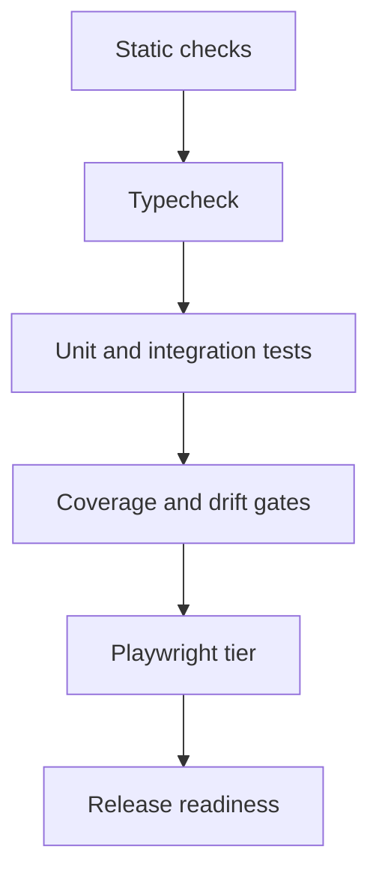

# Continuous Integration & release readiness

CI is defined in [`.github/workflows/ci.yml`](../../.github/workflows/ci.yml). It is
**tiered**: cheap, high-signal checks run on every pull request, while slower or
flakier checks are categorized so they don't make every PR painful. This document
describes the tiers, what runs when, how to reproduce each gate locally, and the
`.next` dev/build race warning (#83).

## CI gate sequence


## Tiers at a glance

| Job (check name) | What it runs | Local command |
| --- | --- | --- |
| **Fast checks (typecheck + lint)** | `tsc --noEmit` + `eslint .` + API catalog drift check | `npm run typecheck && npm run lint` |
| **Unit tests + native coverage** | Node built-in test runner (`tests/**`) plus the 98% native Node line-coverage gate | `npm test && npm run coverage:node -- --summary-only --threshold 98` |
| **Build** | Production Next.js build | `npm run build` |
| **PostgreSQL Migrate / Integration** | PG migrate + integration tests | `npm run test:db` |
| **Supply-chain hygiene** | Lockfile integrity + blocking `npm audit` HIGH/CRITICAL gate | `npm ci --ignore-scripts && npm audit --audit-level=high` |
| **Dependency review** | New-dep vulnerability scan (PRs only; blocks on HIGH/CRITICAL) | — (GitHub Advisory DB) |
| **E2E smoke (Playwright)** | Small browser smoke slice (`e2e/smoke.spec.ts`) | `npm run test:e2e:smoke` |
| **Full UI audit (Playwright)** | 500-case audit, sharded in CI when enabled | `npm run test:e2e:ui-audit:full -- --shard=1/4` |
| **CI summary** | Pass/fail digest in the run summary | — |

For the supply-chain and dependency hygiene policy, severity table, and how to
triage or allowlist an advisory, see [`supply-chain.md`](supply-chain.md).

The **API catalog drift check** runs as a step inside **Fast checks**. See
[API catalog drift gate](#api-catalog-drift-gate) below for details.

All Node jobs use Node.js 24, matching the root `package.json` engine policy and
the production Docker image. The jobs run in parallel (each installs dependencies
with the `npm` cache warm),
so the slowest required gate sets the wall-clock time. Fast checks finish first,
giving quick feedback on trivial type/lint mistakes.

### Why separate jobs (vs. one sequential job)

Each tier is its own job so the PR shows a **clear, separately-named check** for
typecheck/lint, unit tests, build, and database integration. That makes a red
gate obvious at a glance and lets the slow tiers (DB, E2E) run in parallel with
the fast ones instead of serializing behind them. The trade-off is that each job
re-installs dependencies, but the shared `actions/setup-node` npm cache keeps that
to a few seconds, so the signal clarity is worth the small extra cost.

## What runs when

| Event | Fast checks | Unit + coverage | Build | DB integration | Supply-chain / dependency review | E2E smoke | Full UI audit |
| --- | :-: | :-: | :-: | :-: | :-: | :-: | :-: |
| **Pull request → `main`** | ✅ | ✅ | ✅ | ✅ | ✅ (both) | — | — |
| **Pull request → `dev`** | ✅ | ✅ | ✅ | ✅ | ✅ (both) | — | — |
| **Push to `main`** (post-merge) | ✅ | ✅ | ✅ | ✅ | ✅ (supply-chain) | ✅ | — |
| **Push to `dev`** (post-merge) | ✅ | ✅ | ✅ | ✅ | ✅ (supply-chain) | ✅ | — |
| **Nightly schedule** (`0 6 * * *` UTC) | ✅ | ✅ | ✅ | ✅ | ✅ (supply-chain) | ✅ | ✅ (4 shards) |
| **Manual `workflow_dispatch`** | ✅ | ✅ | ✅ | ✅ | ✅ (supply-chain) | ✅ | Optional (`full_ui_audit`) |

- **Required per-PR gates:** fast checks, unit tests + native coverage, build,
  PostgreSQL migrate/integration, supply-chain lockfile integrity, and dependency
  review. `npm audit` blocks when the installed graph contains HIGH/CRITICAL
  advisories; dependency review separately blocks PRs that add or update
  HIGH/CRITICAL vulnerable packages. These gates apply to PRs targeting both
  `main` and `dev`.
- **E2E is tiered off PRs.** Browser runs are slower and more prone to flakiness,
  so smoke runs **after merge** (push to `main` or `dev`), **nightly** (release
  readiness), and **on demand** (the *Run workflow* button). Because the E2E jobs
  are excluded from pull-request events, they can **never block a merge**. A
  failure on `main` or `dev` is visible (not silenced) so it gets noticed, but it
  does not gate PRs.
- **Full UI audit is opt-in outside the nightly.** The 500-case audit runs on the
  nightly schedule and on manual `workflow_dispatch` only when `full_ui_audit` is
  set to true. CI splits it into four shards.

### E2E blocking decision (explicit)

E2E smoke is **non-blocking for PRs by tiering**, not by `continue-on-error`. The
job is excluded from pull-request events entirely, so it cannot turn a PR red. It
*does* run for real on push-to-`main` or push-to-`dev`, nightly, and manual
dispatch, and it is expected to be **green** there (it passes locally and in CI
with cached Chromium).
If it ever starts flaking on `main` or `dev`, fix it or, as a last resort, gate
it behind `workflow_dispatch`/`schedule` only — do **not** add it to the required
PR checks.

The 500-case UI audit is separate from smoke:

```bash
# Small frequent signal
npm run test:e2e:smoke

# High-risk browser regressions (reader/today/admin article flows + mobile viewport probes)
npm run test:e2e:ui-audit:high-risk

# Full audit, locally sharded the same way CI shards it
npm run test:e2e:ui-audit:full -- --shard=1/4
npm run test:e2e:ui-audit:full -- --shard=2/4
npm run test:e2e:ui-audit:full -- --shard=3/4
npm run test:e2e:ui-audit:full -- --shard=4/4
```

### Local Playwright environment

Playwright starts an isolated Next.js server and database rather than reusing
the normal development process. The relevant optional settings are:

| Variable | Default / behavior |
| --- | --- |
| `PLAYWRIGHT_BASE_URL` | `http://127.0.0.1:3100`; controls both the Playwright origin and the web-server host/port. |
| `PLAYWRIGHT_DATABASE_URL` | `file:./e2e.db`; guarded as a destructive test database and passed to the Playwright web server as `DATABASE_URL`. |
| `PLAYWRIGHT_CHROMIUM_EXECUTABLE_PATH` | Optional absolute Chromium path. When the configured or local cached path does not exist, Playwright uses its normal browser resolution. |
| `NEXT_DIST_DIR` | Optional Next.js build-output directory for ordinary runs. The Playwright web server forces `.next-e2e` so it can run alongside `npm run dev` without sharing `.next/dev/lock`. |
| `PLAYWRIGHT_VISUAL_REGRESSION` | Set to `1` to opt into `e2e/visual-regression.spec.ts`; otherwise that suite is skipped. |
| `UI_AUDIT_ARTIFACT_DIR`, `UI_AUDIT_RUN_ID` | Override the UI audit output directory and run identifier; absent run ids are timestamped locally. |

Keep `PLAYWRIGHT_DATABASE_URL` isolated from development and production data.
The safety guard rejects an unsafe target before destructive fixture setup.

### UI audit artifacts

The route-family UI audit specs (`e2e/ui-audit-public-auth.spec.ts`,
`e2e/ui-audit-reader-learning.spec.ts`, `e2e/ui-audit-classroom.spec.ts`, and
`e2e/ui-audit-admin-operations.spec.ts`) write machine-readable audit output under
`test-results/ui-audit/` by default, including:

- `catalog.json` — the registered 500-case matrix.
- `latest-run.json` — the active run id and relative artifact paths.
- `results-<run-id>.jsonl` — one result record per executed scenario.

CI sets `UI_AUDIT_ARTIFACT_DIR=test-results/ui-audit` and a shard-specific
`UI_AUDIT_RUN_ID`. Full-audit runs upload the UI audit directory, Playwright
`test-results/`, and `playwright-report/` for every shard with **14-day**
retention. The smoke job uploads Playwright `test-results/` and
`playwright-report/` on failure with **7-day** retention.

For local debugging, keep artifacts in the repository workspace and override the
directory only when useful:

```bash
UI_AUDIT_ARTIFACT_DIR=test-results/ui-audit-debug npm run test:e2e:ui-audit:high-risk
```

## Native Node coverage gate

The **native Node coverage gate** runs inside **Unit tests + native coverage** on
every pull request, push to `main`, nightly run, and manual run:

```bash
npm run coverage:node -- --summary-only --threshold 98
```

The gate uses Node's native `--experimental-test-coverage` output, measures the
configured source prefixes (`src/`, `scripts/`, and `eslint-rules/`), and fails
the job when any measured file drops below **98% line coverage** or no coverage
table is produced. It is blocking anywhere the `unit-tests` job is required.

## API catalog drift gate

The **API catalog drift check** runs as a step inside the **Fast checks** job on
every pull request and push to `main`. It:

1. Regenerates `docs/platform/api-catalog.json` and `docs/platform/api-catalog.md`
   by running `npm run api-catalog` (pure static analysis — no database or dev
   server required).
2. Runs `git diff --exit-code` on both files.  If there are any differences, the
   step fails and prints the stale lines with a fix command.

The check is **deterministic**: the generator reads source files only and produces
the same output on every run for the same route files.

### When does it fail?

- A new `src/app/api/**/route.ts` was added without regenerating the catalog.
- An existing route changed its auth wrapper, capability, response format, or
  HTTP methods without regenerating.
- `docs/platform/api-catalog.json` or `.md` was manually edited.

### How to fix it

```bash
npm run api-catalog
git add docs/platform/api-catalog.json docs/platform/api-catalog.md
git commit -m "chore: regenerate API catalog"
```

See [API catalog](./api-catalog.md) for the full catalog reference and
[`src/tools/api-catalog.ts`](../../src/tools/api-catalog.ts) for the generator.

## Dependency caching

- **npm:** every job uses `actions/setup-node@v6` with `cache: "npm"`, so the
  dependency download is cached across runs and keyed on `package-lock.json`.
- **Playwright browsers:** the E2E smoke and UI audit jobs cache
  `~/.cache/ms-playwright` with
  `actions/cache@v6`, keyed on the resolved `@playwright/test` version, so Chromium
  is only re-downloaded when the Playwright dependency changes. The job still runs
  `npx playwright install --with-deps chromium` every time (fast on a cache hit) to
  install the OS-level libraries Chromium needs.

## Failure summaries

- The **CI summary** job writes a concise pass/fail checklist of the required gates
  to the run summary (`$GITHUB_STEP_SUMMARY`) — a green checklist on success or a
  table highlighting which gate failed. It is informational (always exits 0); the
  individual jobs remain the gating checks.
- The **Build** job adds a failure-only diagnosis note to the summary with the most
  common causes (including the `.next` race below) and the exact local reproduction
  steps.

## Test data and fixtures

Unit tests use in-memory fakes from `tests/support/`; integration tests seed
prefixed rows (`dbit_`) via helpers in `tests/db/support/`.  See
[test data and fixture governance](./test-data-governance.md) for the full
policy covering shared helper usage, the `dbit_` prefix, cleanup, and privacy
rules.

## Reproducing each gate locally

```bash
# Shared environment (SQLite). Real secrets are never needed for CI gates.
export DATABASE_URL=file:./ci.db
export NEXTAUTH_SECRET=dev-secret
export NEXTAUTH_URL=http://localhost:3000

npm ci
npx prisma generate

# Fast checks
npm run typecheck
npm run lint

# API catalog drift check (part of Fast checks — no DB needed)
npm run api-catalog
git diff --exit-code docs/platform/api-catalog.json docs/platform/api-catalog.md && echo "NO DRIFT"

# Unit tests (DB-free; they mock @/lib/prisma)
npm test

# Native Node coverage gate (same threshold as CI)
npm run coverage:node -- --summary-only --threshold 98

# Build (migrate first so statically-generated routes have a schema)
npx prisma migrate deploy
rm -rf .next && npm run build

# PostgreSQL migrate / integration (needs a running PostgreSQL — see docs/platform/database.md)
npm run test:db

# E2E smoke (Playwright) — installs the matching Chromium on first run
npx playwright install --with-deps chromium
npm run test:e2e:smoke

# UI audit slices
npm run test:e2e:ui-audit:high-risk
npm run test:e2e:ui-audit:full -- --shard=1/4
```

## ⚠️ The `.next` dev/build race (#83)

The dev server (`npm run dev`) and a production build (`npm run build`) share the
`.next/` output directory. Running a build **while the dev server is active**
causes a file-write race that reproducibly triggers `PageNotFoundError` for
`(app)` route-group pages. The build output is scrambled and the error is
non-deterministic.

**Rule:** stop the dev server before building, and clean a possibly-stale cache
first:

```bash
rm -rf .next && npm run build
```

CI follows this rule: the **Build** job runs `rm -rf .next` immediately before
`npm run build` so a stale or cached `.next/` can never race the build. If a build
fails in CI, the failure-diagnosis summary points back here.

