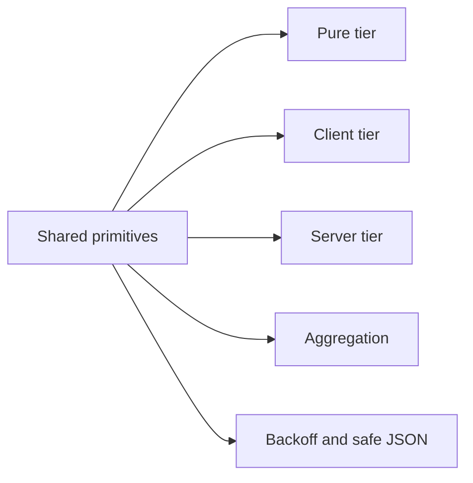

# Platform Primitives

> **Canonical reference:** [`src/lib/primitives/README.md`](../../src/lib/primitives/README.md)
>
> This file is a summary pointer. The authoritative classification table,
> contribution guidelines, and stability contract live in the README above.

## Primitive tiers

---

## Overview

Platform primitives are small, self-contained utility modules that are
genuinely reused across unrelated call sites. They live in `src/lib/` and are
surfaced through three boundary-aware barrels in `src/lib/primitives/`.

Every primitive is classified by its **boundary tier**, which determines where
it may be safely imported:

| Barrel | Import path | Allowed environments |
|--------|-------------|----------------------|
| **Pure** | `@/lib/primitives/pure` | Browser, Node.js, Edge — no DOM, no `node:*`, no server-only APIs |
| **Client** | `@/lib/primitives/client` | Browser / React only — may use DOM APIs and React hooks |
| **Server** | `@/lib/primitives/server` | Node.js server only — may use `server-only`, `node:*`, Prisma |

---

## Current primitives

### Pure (universal)

| Module | Key exports |
|--------|-------------|
| `@/lib/aggregation` | `percentage`, `wholePercentage`, `averageRounded`, `isoWeek`, `lastNWeeks`, `fillWeekBuckets`, `bucketize` |
| `@/lib/backoff` | `jitteredExponentialBackoff` |
| `@/lib/safe-json` | `safeJsonStringify` (**security-sensitive** — XSS-safe JSON for `<script>`) |
| `@/lib/format-relative` | `formatRelative` |
| `@/lib/list-name-validation` | `validateListName`, `LIST_NAME_MAX_LENGTH` |
| `@/lib/primitives/pure` (inline) | `clamp01`, `truncateStr` |

### Client-only

| Module | Key exports |
|--------|-------------|
| `@/lib/cn` | `cn`, `focusRing` |
| `@/lib/storage-keys` | `STORAGE_KEYS`, `lsGet`, `lsSet`, `lsRemove`, `ssGet`, `ssSet`, `ssRemove` |
| `@/lib/focus-trap` | `getTabbable`, `useFocusTrap` (**security-sensitive** — focus containment) |
| `@/lib/use-roving-tabindex` | `useRovingTabindex` |

### Server-only

| Module | Key exports |
|--------|-------------|
| `@/lib/sanitize` | `sanitizeArticleHtml` (**security-sensitive** — HTML sanitization) |

---

## Ownership rules

- **Do not** add domain services, Prisma-typed APIs, or temporary migration
  wrappers to `src/lib/primitives/`.
- **Do not** promote a single-feature helper to a first-class primitive; keep
  it feature-local until it is reused from two or more unrelated call sites.
- **Remove obsolete compatibility wrappers** rather than expanding them. When a
  shim's only remaining importers can be cheaply repointed to the canonical
  source, do so and delete the shim.
- Roving keyboard groups delegate enabled-item discovery, wrapping, `tabindex`
  mutation, and focus movement to `useRovingTabindex`. Callers provide only the
  item selector, orientation, optional Home/End and Escape policy, and domain
  activation callback.
- Security-sensitive helpers in any tier must note the security concern in the
  module header (see `@/lib/safe-json`, `@/lib/focus-trap`, `@/lib/sanitize`).

---

## Redaction policy

Sensitive-key detection and value scrubbing is **not** a primitive — it is
owned by the security subsystem at `@/lib/security/redaction`.  The legacy
path `@/lib/observability/redaction` (a backward-compat shim from #627/#676)
was removed in #690; import from `@/lib/security/redaction` or `@/lib/security`
instead.

