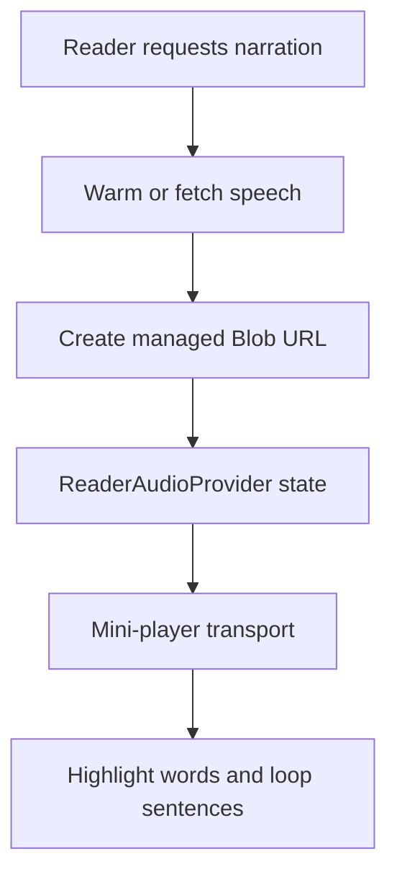

# Reader playback UX

This document covers the Reader subsystem's ownership of audio playback: the
`ReaderAudioProvider` context, `ReaderMiniPlayer` transport controls, word
highlighting, speed and sentence-loop controls, and access-checked playback
initiation.

For speech generation and `ArticleSpeech` semantics, see
[`../speech/generation.md`](../speech/generation.md). For media asset lifecycle
and storage, see [`../media/assets.md`](../media/assets.md) and
[`../media/storage.md`](../media/storage.md). For TTS job scheduling, see
[`../operations/tts-jobs.md`](../operations/tts-jobs.md).

## Playback lifecycle


## Ownership boundary

**Reader owns** the mini-player transport UI, word-highlighting UI, playback
speed controls, sentence-loop UX, the single shared `<audio>` element, and the
narration-fetch adapter (`useNarrationApi`).

**Reader does not own** storage lifecycle policy (owned by Media), TTS provider
or synthesis (owned by Speech), or job retry scheduling (owned by Operations).
Storage backend decisions are resolved server-side. The Reader receives a
same-origin, access-checked audio URL and remains unaware of the storage path.

## Architecture: single audio element

`ReaderAudioProvider` (`src/components/ReaderAudioProvider.tsx`) hoists a single
`<audio>` element into React context so both the Listen-tab transcript
(`ArticleSpeech`) and `ReaderMiniPlayer` share one player with no duplicate
audio elements.

```
ReaderAudioProvider
  ├── <audio ref={audioRef} …>   — single audio element for the page
  ├── useNarrationApi            — POST /speech metadata + audio URL
  ├── useActiveWord              — binary-search active-word index
  └── useLoopSegment             — sentence-loop capture + seek
```

Components consume context via `useReaderAudio()`.

## Component map

| Component / Hook | File | Purpose |
| ---------------- | ---- | ------- |
| `ReaderAudioProvider` | `src/components/ReaderAudioProvider.tsx` | Context + single `<audio>` element. |
| `ReaderMiniPlayer` | `src/components/ReaderMiniPlayer.tsx` | Docked fixed-bottom transport bar. |
| `ReaderListenButton` | `src/components/ReaderListenButton.tsx` | Sticky toolbar Listen affordance. |
| `useNarrationApi` | `src/components/reader/useNarrationApi.ts` | Narration metadata fetch + audio URL handoff. |
| `useActiveWord` | `src/components/reader/useActiveWord.ts` | Binary-search word-highlight index. |
| `useLoopSegment` | `src/components/reader/useLoopSegment.ts` | Sentence-loop capture and seek. |
| `useAudioRangePlayback` | `src/components/reader/useAudioRangePlayback.ts` | Bounded-range playback for dictation/practice. |

## Playback initiation (access-checked)

Narration is fetched lazily on first Listen-tab activation or Listen-button click:

1. `warmNarration(articleId)` (from `useNarrationApi`) posts to
   `POST /api/reader/[id]/speech`.
2. The route calls `getOrCreateArticleSpeech(articleId, context)` which
  enforces article-access policy before returning narration metadata.
  Unauthenticated or unauthorized requests receive `null` from the route and
  the Reader shows no audio.
3. If the API returns `fallback: true` or no `audioUrl`, the Reader marks
  fallback — the mini-player never appears and the Listen button is disabled.
4. On success, the same-origin `audioUrl` is loaded directly into the shared
  `<audio>` element. The browser then requests the authenticated audio GET
  route; media-load failures enter the same fallback state.

`warmNarration` is idempotent: the first successful call caches the result and
subsequent calls are no-ops. A failed call may be retried.

## Mini-player

`ReaderMiniPlayer` appears only after narration has loaded successfully
(`isLoaded && !isFallback`) and has not been dismissed for the session.

Controls provided:

| Control | Behaviour |
| ------- | --------- |
| Play / Pause | Toggles `audioRef.current.play()` / `.pause()`. |
| Skip −10 s | Seeks `currentTime -= 10`. |
| Skip +10 s | Seeks `currentTime += 10`. |
| Seek bar | `<input type="range">` with teal gradient fill; scrubs `currentTime`. |
| Time readout | Displays `currentTime / duration` in `m:ss` format. |

The authenticated audio endpoint supports HTTP byte ranges, so skip and scrub
controls can seek beyond the portion of Narration already buffered by the
browser.
| Speed select | Cycles through `[0.5, 0.75, 1, 1.25, 1.5]`; sets `audioRef.current.playbackRate`. |
| Loop toggle | Activates sentence-loop mode (see below). |
| Close (×) | Dismisses the player for the current session (per-page state). |

The mini-player does not own the `<audio>` element — it reads `audioRef` from
context and attaches native event listeners (`play`, `pause`, `timeupdate`,
`durationchange`, `ended`).

## Word highlighting

`useActiveWord` (`src/components/reader/useActiveWord.ts`) tracks the index of
the currently highlighted word:

- Receives the `SpeechWord[]` array (word, offset ms, duration ms) from context.
- On each `onTimeUpdate` event from the `<audio>` element, `updateActiveWord(time)`
  binary-searches the sorted timing array for the last word whose `offset ≤
  currentTime`.
- A 400 ms trailing-silence grace window clears the active index when the
  playback cursor is past a word's end and the next word has not yet started.
- Word highlights are applied in the prose via a `WordLookup`-level highlight
  gate (`listenActive`) that suppresses auto-scroll when the Listen tab is not
  the active visible panel, so background playback never hijacks the reading
  scroll position.
- `useReaderTextMap` owns the DOM ordering shared with persistent annotations:
  it first renders semantic `<mark class="rw-hl">` elements, then rebuilds
  Narration ranges against the resulting live text nodes. This prevents cached
  ranges from referring to nodes detached by highlight rendering while keeping
  CSS Highlights responsible only for the active Narration word.

## Sentence-loop controls

`useLoopSegment` (`src/components/reader/useLoopSegment.ts`) provides
sentence-loop UX:

- On `toggleLoop()`, captures the `DictationSegment` containing `audio.currentTime`.
  If the cursor is past the segment's end, it seeks back to the segment start.
- While looping is active, the `onTimeUpdate` handler in `ReaderAudioProvider`
  detects `currentTime >= loopSegment.endTime - 0.05` and seeks back to
  `loopSegment.startTime`.
- A second `toggleLoop()` cancels the loop. Loading new audio (`loadAudio(...)`)
  also cancels any active loop unconditionally.

`DictationSegment` boundaries are computed from article-derived reader text and
`ArticleSpeech.words` at load time via `segmentDictation(plainText, words)`.
Speech reconstructs `plainText` from the persisted Narration text basis so a
capped Narration and its word timings share the same Reader text scope.

## Audio URL delivery

`useNarrationApi` separates narration provisioning from audio delivery:

- `POST /api/reader/{id}/speech` generates or resolves narration and returns
  timing metadata plus an authenticated `audioUrl`.
- The shared `<audio>` element uses that same-origin URL directly, so the
  browser fetches media bytes from `GET /api/reader/{id}/speech/audio`.
- A media-load failure enters the same graceful fallback state as an
  unavailable narration provider.

The Reader never receives raw storage keys or base64 narration audio.

## Bounded-range playback

`useAudioRangePlayback` (`src/components/reader/useAudioRangePlayback.ts`)
provides `playRange(range, opts)` and `stopRange()` for tools (dictation,
pronunciation practice) that need "play this sentence and stop at the boundary."
It attaches a `timeupdate` listener, pauses the shared element at `range.endTime`,
and cleans up the listener on stop or unmount.

## State summary

| Context value | Source | Consumers |
| ------------- | ------ | --------- |
| `audioRef` | `useRef<HTMLAudioElement>` | `ReaderMiniPlayer`, `ArticleSpeech`, range tools |
| `words` | `useNarrationApi → loadAudio` | `useActiveWord`, dictation |
| `segments` | `segmentDictation(plainText, words)` | `useLoopSegment`, dictation |
| `activeIndex` | `useActiveWord` | Prose word highlight, Listen-tab transcript |
| `isLoaded` | set by `loadAudio` / `markFallback` | Mini-player visibility guard |
| `isFallback` | set by `markFallback` | Listen button disabled state |
| `isLooping` | `useLoopSegment` | Mini-player loop-button active state |
| `isWarming` | `useNarrationApi` | Listen button spinner |

## Related docs

- [`../speech/generation.md`](../speech/generation.md) — TTS provider seam,
  `ArticleSpeech` generation, voice/format fallback.
- [`../media/assets.md`](../media/assets.md) — `MediaAsset` schema, storage keys,
  deletion.
- [`../media/storage.md`](../media/storage.md) — storage backends, migration,
  readiness.
- [`../operations/tts-jobs.md`](../operations/tts-jobs.md) — TTS job scheduling,
  retry, rebuild.

