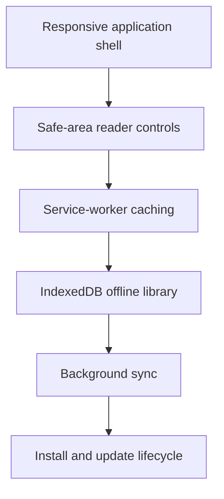

# Mobile Reader and PWA experience baseline

This document defines the mobile/touch behavior baseline for the ReadWise Reader, offline library, and PWA install surface. It is grounded in the actual service worker (`public/sw.js`), web-app manifest (`src/app/manifest.ts`), offline library page (`src/app/(app)/offline/page.tsx`), and Reader component set (`src/components/Reader*`).

## Mobile PWA flow


## Code map

| Area | Code | Purpose |
| --- | --- | --- |
| Mobile shell | `src/app/tokens.css`, `src/components/shell/AppShell.tsx`, `src/components/shell/BottomTabBar.tsx`, `src/components/ui/Sheet.tsx` | Shared bottom-bar sizing, content reservation, home-indicator padding, and bottom-sheet behavior. |
| Reader layout | `src/app/styles/reader-layout.css`, `src/components/ReaderMiniPlayer.tsx` | Mini-player height and final-content clearance. |
| Reader floating actions | `src/components/reader/ReaderFloatingSurface.tsx`, `src/components/ui/floating-layout.ts`, `src/components/ui/useFloatingPosition.ts` | Reader semantics over shared placement, safe-area, constraint, and viewport-reflow mechanics. |
| Offline/PWA | `public/sw.js`, `src/app/manifest.ts`, `src/app/(app)/offline/page.tsx`, `src/lib/offline/` | Manifest, caching, saved articles, and mutation replay. |
| Coverage | `tests/safe-area-contract.test.ts`, `tests/ui-popover-layout.test.ts`, `tests/use-floating-position.test.ts`, `e2e/mobile-safe-area.spec.ts`, `e2e/mobile-reader-pwa.spec.ts` | Deterministic geometry/contracts plus mobile browser smoke coverage. |

---

## 1. Viewport and responsive layout

ReadWise uses a single-column responsive layout with `viewport` meta tag `width=device-width, initial-scale=1` (present on both `offline.html` and `offline-reader.html`; set globally in the Next.js app layout).

| Breakpoint | Behaviour |
|------------|-----------|
| `< 640 px` (mobile) | Single-column. Toolbar controls stack vertically as needed. Display panel opens as a bottom **Sheet** (full-width, modal). Reader text uses the full viewport width minus `1 rem` side padding. |
| `≥ 640 px` (sm / desktop) | Toolbar may show a **Popover** anchored to the trigger button. Side panels appear inline where layout allows. |

`ReaderControls` detects viewport width at runtime via `useMediaQuery("(min-width: 640px)")` and chooses between a Sheet (mobile) and Popover (desktop) for the Display preferences panel.

The offline fallback pages (`/offline.html`, `/offline-reader.html`) use `min-height: 100dvh` and `padding: 0 1rem 4rem` so content is fully visible inside browser chrome and safe-area insets on iOS/Android.

### Safe-area insets

Mobile shell geometry uses two distinct tokens. `--bottom-bar-h` is the 56 px
content/touch-target height; `--bottom-bar-total-h` adds
`env(safe-area-inset-bottom, 0px)`. `BottomTabBar` applies the inset as its own
bottom padding, while `AppShell` reserves the total height below page content
and resets that reservation at the desktop breakpoint. Bottom Sheets and the
Reader tools surface apply their own safe-area padding rather than relying on
the shell reservation.

The Reader has a separate transport contract:
`--reader-mini-player-height` includes the bottom inset, and
`--reader-bottom-clearance` reserves the player plus a tokenized gap on
`.reader-column`. Reader text-action surfaces pass the mini-player height to
the shared floating-position hook as a bottom safe area, so selection actions,
dictionary lookup, highlight editing, grammar, and sentence translation cannot
open behind the transport bar. Offline fallback pages use standalone CSS with
their own bottom padding.

---

## 2. PWA install / manifest

The web-app manifest is served from `/manifest.webmanifest` (generated by `src/app/manifest.ts` via Next.js `MetadataRoute.Manifest`).

| Property | Value |
|----------|-------|
| `name` / `short_name` | `ReadWise` (sourced from `SITE_NAME` in `src/lib/copy/site.ts`) |
| `display` | `standalone` |
| `start_url` | `/` |
| `theme_color` | `#4f46e5` (brand primary, matches `--primary` in `tokens.css`) |
| `background_color` | `#ffffff` |
| Icons | SVG (`any`), 192 × 192 PNG, 512 × 512 PNG, 512 × 512 PNG maskable |

Icon paths are imported from `src/lib/assets.ts` (`ICON_SVG`, `ICON_192`, `ICON_512`) — the single source of truth for all static asset URLs.

Apple-specific icons (`apple-touch-icon`, 180 × 180) are declared in the root `<head>` via Next.js layout metadata and served from `/icons/apple-touch-icon.png`.

---

## 3. Service worker and caching strategy

`public/sw.js` (cache version `v3`, name `readwise-v3`) implements:

| Request type | Strategy |
|--------------|----------|
| `/_next/static/**` | Cache-first (versioned, immutable) |
| HTML navigations | Network-first; falls back to `/offline.html` on failure |
| `/reader/**` HTML | Network-first; falls back to `/offline-reader.html` on failure |
| API routes (`/api/**`) | Network-only (authenticated responses are never cached) |

On **install** the SW pre-caches `/offline.html` and `/offline-reader.html` so they are available on the very first offline visit, even before the user has cached any other resources.

On **activate** the SW calls `self.clients.claim()` and purges all stale `readwise-*` caches, ensuring a reader using the app when a new SW deploys never reads from an expired cache.

---

## 4. Offline reading flow

### Saving an article

1. Reader opens an article at `/reader/:id`.
2. The toolbar's **Offline** button triggers `POST /api/reader/:id/offline` (implemented in `src/app/api/reader/[id]/offline/route.ts`), which returns the article content as JSON.
3. The article is stored in IndexedDB (`readwise-offline` database, `articles` object store) via `src/lib/offline/article-store.ts`.
4. Articles expire after **30 days** (enforced client-side in the Offline Library UI).

### Reading offline

When the user navigates to `/reader/:id` while offline the SW intercepts the request and serves `/offline-reader.html`. That page reads the stored article from IndexedDB and renders it in a minimal but full-featured reading view (dark-mode aware, serif type, sticky header with Back/Listen controls).

### Offline library (`/offline`)

`src/app/(app)/offline/page.tsx` is a `"use client"` page that reads entirely from IndexedDB — no server requests. It renders:

- **"Offline Library"** heading (with `WifiOff` icon).
- Instructional subtitle: *"Articles saved here are available when you're offline. They expire after 30 days."*
- A list of saved articles with Read and Remove actions.
- Graceful fallback if IndexedDB is unavailable (e.g., private browsing on iOS Safari).
- The page is authenticated via middleware redirect; unauthenticated users are sent to `/signin`.

### Offline mutation queue

While offline, reading-progress updates, highlights, and notes are enqueued in IndexedDB (`mutations` object store). When connectivity is restored the SW fires a `sync` event with tag `readwise-mutations`, which signals the client to flush the queue via `src/lib/offline-sync.ts`. Mutations use full-jitter exponential back-off and remain in a terminal `failed` state after five retries (or immediately after a permanent 4xx error) until the queue is purged on sign-out/account deletion. Stored failure diagnostics are controlled client-generated reason/status codes, never response or exception prose.

---

## 5. Touch targets

All interactive controls in the Reader toolbar (`ReaderControls`) use the `IconButton` component (`src/components/ui/IconButton.tsx`), which applies `focusRing` and padding such that the touch target area meets the 44 × 44 CSS-pixel minimum recommended by WCAG 2.5.5.

The `ReaderMiniPlayer` transport controls (Play/Pause, Skip ±10 s, Speed, Loop, Close) are also rendered via `IconButton`.

The offline library list items include dedicated `<button>` elements for Remove and `<a>` elements for Read, both with `aria-label` providing context (e.g., *"Remove Article Title from offline library"*).

---

## 6. Reader toolbar (mobile)

`ReaderControls` renders a slim sticky toolbar at the top of the reader with four affordances:

| Control | Mobile behaviour |
|---------|-----------------|
| **Back** (`ReaderBackButton`) | Returns to the previous page. |
| **Listen** (`ReaderListenButton`) | Initiates narration fetch; loads `ReaderMiniPlayer`. If the Speech service is unconfigured (`fallback:true`) the mini-player does not appear. |
| **Aa** (Display preferences) | Opens a bottom **Sheet** (full-width, modal). Esc or outside-tap closes and returns focus to the Aa button. |
| **Practice tools** | Opens the tools panel (quiz, vocabulary). Toggles via `ReaderToolsProvider`. |

An `aria-live="polite"` region persists in the DOM for font-size announcements regardless of Display panel state, ensuring reliable screen-reader delivery on mobile.

### Mini-player non-overlap

`ReaderMiniPlayer` is fixed to the bottom of the viewport. On mobile it occupies the full width. The reader column reserves bottom padding equal to the mini-player height plus the safe-area inset and an additional tokenized gap, so body text, study actions, and keep-reading cards remain scrollable above the player.

### Reader floating-surface positioning

Reader text actions use `ReaderFloatingSurface`, which composes the shared
`useFloatingPosition` hook. Anchors may be a pointer coordinate, a captured
rectangle, or a live element ref; highlight editing uses a live ref so scrolling
or layout changes remeasure the current `<mark>` position rather than a stale
snapshot.

Layout uses the visual viewport when the browser exposes it, including its
offset during zoom or on-screen-keyboard changes. Recalculation is scheduled on
anchor/surface resize, window resize or orientation change, capture-phase
scroll, and visual-viewport resize/scroll. The geometry layer then flips or
clamps the surface inside viewport padding and the Reader mini-player safe area,
while preserving a stricter authored maximum size and enabling internal scroll
when vertical space is limited.

---

## 7. Known limitations and gaps

| Gap | Notes |
|-----|-------|
| iOS Safari private browsing | IndexedDB is available in private browsing on iOS 16.4+ but older Safari may return an error; the Offline Library shows a graceful message (`role="status"`). |
| Push / Background-sync | `BackgroundSync` is not supported in WebKit/Safari; the mutation-queue flush falls back to a `message`-based mechanism initiated on reconnect by `ReaderTimeTracker`. |
| Reduced motion | `prefers-reduced-motion` is not explicitly applied to the Sheet/Popover animation. CSS `transition` durations should be conditionally disabled; this is a gap relative to the accessibility baseline. |
| Hardware notch verification | Chromium smoke tests expose a zero-pixel safe-area inset. Token arithmetic and zero-inset geometry are automated, but a non-zero home-indicator inset still requires a physical device or explicit browser viewport override. |

---

## 8. Testing

Smoke tests for the mobile viewport are in `e2e/mobile-reader-pwa.spec.ts`. They run inside a 390 × 844 px viewport (iPhone 14 emulation) and cover:

- Reader loads and renders the article heading on a mobile viewport.
- Reader toolbar is visible on mobile.
- Reader mini-player clearance keeps final content and page actions above the fixed player.
- Offline library page loads on mobile with the correct heading.
- `/manifest.webmanifest` is reachable and contains the expected `name` and `display` fields.

Additional focused coverage:

- `tests/safe-area-contract.test.ts` locks shell token arithmetic, mobile content
	reservation, BottomTabBar sizing, and Sheet/Reader safe-area padding.
- `tests/ui-popover-layout.test.ts` covers Reader mini-player avoidance,
	flip/clamp behavior, constrained landscape sizing, and CSS-variable length
	resolution.
- `tests/use-floating-position.test.ts` verifies that scroll-triggered layout
	remeasures a live element anchor.
- `e2e/mobile-safe-area.spec.ts` probes two mobile viewport sizes in light/dark
	shell states, final-content clearance, bottom Sheet actions, and Reader tools.

Run the full E2E suite to exercise these specs:

```sh
npm run test:e2e:smoke
```

See also `e2e/offline-pwa.spec.ts` for broader offline/library/progress/notes coverage, and `e2e/accessibility.spec.ts` for WCAG automated checks.
